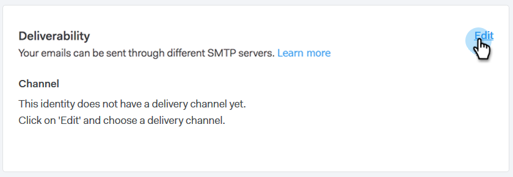
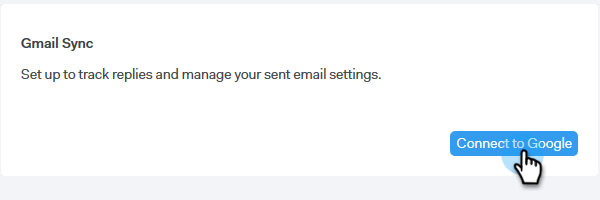
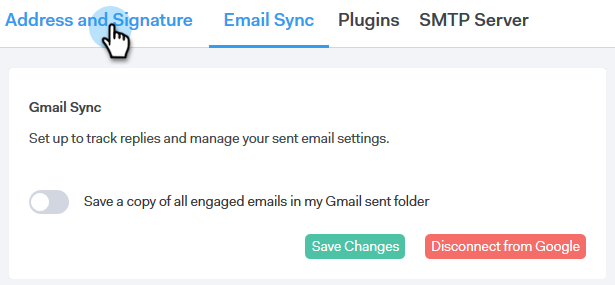

# Configuração do Canal do Delivery {#setting-up-your-delivery-channel}

Ao start usando o Marketing to Sales Connect, você precisará configurar um servidor SMTP para enviar emails.

>[!NOTE]
>
>Além de configurar seu servidor SMTP, sua identidade de [email precisa ser verificada](http://docs.marketo.com/x/ewPh) antes de enviar emails.

Você pode optar por enviar emails usando um Servidor SMTP Personalizado, um Servidor SMTP de Equipe ou Gmail como canal de delivery. Vamos analisar cada opção.

## SMTP personalizado {#custom-smtp}

1. Faça logon no aplicativo [da](http://toutapp.com/login)Web, clique no ícone de engrenagem na parte superior direita e escolha **Configurações**.

   

1. Em Minha conta, clique em Configurações **de** email.

   

1. Selecione Servidor **** SMTP.

   

1. Digite suas credenciais do Servidor SMTP e clique em **Conectar**.

   

   >[!NOTE]
   >
   >Se este for seu único canal de delivery, ele será automaticamente atribuído a todas as suas identidades de email, e você estará pronto aqui. Se este não for seu único canal de delivery, continue com a Etapa 5.

1. Ainda em Configurações de email, clique em **Endereço e assinatura**.

   

1. Localize a identidade do e-mail para o qual você deseja escolher um canal de delivery e clique em **Escolher Canal** de Delivery.

   

1. No Cartão de entrega, clique em **Editar**.

   

1. Clique na lista suspensa Canal e escolha o canal de delivery personalizado que você acabou de adicionar. Clique em **Salvar**.

   

   >[!NOTE]
   >
   >Se o administrador da equipe configurar o Team SMTP Server, ele será automaticamente aplicado somente à sua identidade de email padrão e estará disponível como uma opção para suas outras identidades de email.

   **Assistir a um vídeo**`<iframe width="630" height="470" src="//play.vidyard.com/YWKSgZvBEjUU8FrXZ5hdYR.html?v=3.1.1" frameborder="0" allowfullscreen></iframe>`

## Servidor SMTP de Equipe {#team-smtp-server}

>[!NOTE]
>
>**Permissões de administrador necessárias**

1. Faça logon no aplicativo [da](http://toutapp.com/login)Web, clique no ícone de engrenagem na parte superior direita e escolha **Configurações**.

   

1. Em Configurações de administrador, clique em Servidor **SMTP de** equipe.

   

1. Digite suas credenciais do Servidor SMTP e clique em **Conectar**.

   

   >[!NOTE]
   >
   >O Team SMTP Server será o canal de delivery padrão da identidade de email padrão para todos os membros da equipe. Além disso, ele estará disponível como uma opção de canal de delivery para todas as outras identidades de email.

   ** Ver um vídeo**`<iframe width="630" height="470" src="//play.vidyard.com/Ky9EwGmLcgvsMpFq3H8Y6n.html?v=3.1.1" frameborder="0" allowfullscreen></iframe>`

## Gmail {#gmail}

1. Faça logon no aplicativo [da](http://toutapp.com/login)Web, clique no ícone de engrenagem na parte superior direita e escolha **Configurações**.

   

1. Em Minha conta, clique em Configurações **de** email.

   

1. Clique em **Sincronização** por email.

   

1. Clique em **Conectar-se ao Google**.

   

1. Faça logon usando suas credenciais do Google.
1. Quando chegar a esta tela, clique em **Permitir**.

   

   >[!NOTE]
   >
   >Se este for seu único canal de delivery, ele será automaticamente atribuído a todas as suas identidades de email, e você estará pronto aqui. Se o Gmail não for seu único canal de delivery, continue com a Etapa 7.

1. Clique em **Endereço e assinatura**.

   

1. Clique na identidade de e-mail para a qual você deseja que o Gmail seja o canal do delivery.

   

1. Quando o painel deslizante abrir, role para baixo até o Cartão de entrega.

   

1. Clique na lista suspensa Canal e escolha o canal delivery Gmail que você acabou de adicionar. Clique em **Salvar**.

   

   >[!NOTE]
   >
   >Se o administrador da equipe configurar o Team SMTP Server, ele será automaticamente aplicado somente à sua identidade de email padrão e estará disponível como uma opção para suas outras identidades de email.

