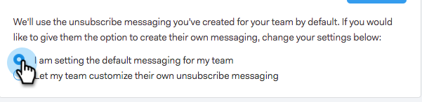

# Personalizar mensagem de link de cancelamento de assinatura {#customize-unsubscribe-link-message}

Sempre permitimos que as equipes personalizassem as mensagens de link de cancelamento de inscrição, mas agora os administradores podem definir as mensagens de link de cancelamento de inscrição para toda a equipe, para garantir mensagens consistentes.

>[!NOTE]
>
>Você não pode usar um link de cancelamento de assinatura de terceiros com o Sales Connect, pois essas informações não serão capturadas de volta no nosso banco de dados.

## Personalizar mensagens para você mesmo {#customize-messaging-for-yourself}

1. Faça logon no [aplicação web](https://toutapp.com/login), clique no ícone de engrenagem na parte superior direita e escolha **Configurações**.

   

1. Em Minha conta, selecione **Cancelamentos de assinatura**.

   

1. Escreva suas mensagens personalizadas na caixa de texto.

   

1. Realce o texto em que deseja que as pessoas clicem para acessar sua página de cancelamento de inscrição e clique no ícone de link.

   

   >[!NOTE]
   >
   >Não importa qual é o URL que está sendo hipervinculado. Quando o email for enviado, esse hiperlink será convertido em nosso link de cancelamento de assinatura.

1. Clique em **OK**.

   

## Definir mensagens de cancelamento de assinatura para sua equipe {#set-unsubscribe-messaging-for-your-team}

1. Faça logon no [aplicação web](https://toutapp.com/login), clique no ícone de engrenagem na parte superior direita e escolha **Configurações**.

   

1. Em Configurações de administração, selecione **Cancelamentos de assinatura**.

   

1. Personalize suas mensagens e clique em **Salvar** quando concluído.

   

1. Selecionar **Estou configurando as mensagens padrão para minha equipe** para que as mensagens se apliquem a todos os usuários.

   
