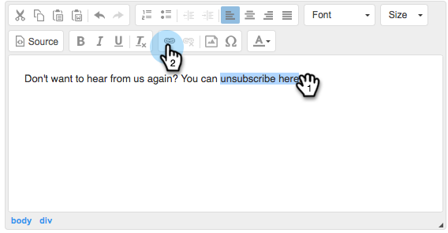

# Personalizar mensagem do link de cancelamento de inscrição {#customize-unsubscribe-link-message}

Sempre permitimos que as equipes personalizem as mensagens de link de cancelamento de inscrição, mas agora os administradores podem definir as mensagens de link de cancelamento de inscrição para toda a equipe, garantindo mensagens consistentes.

>[!NOTE]
>
>Você não pode usar um link de cancelamento de inscrição de terceiros com o Sales Connect, pois essas informações não serão capturadas no nosso banco de dados.

## Personalize mensagens para si mesmo {#customize-messaging-for-yourself}

1. Faça logon no [aplicativo Web](https://toutapp.com/login), clique no ícone de engrenagem na parte superior direita e escolha **Configurações**.

   

1. Em Minha conta, selecione **Cancelar assinatura**.

   

1. Escreva suas mensagens personalizadas na caixa de texto.

   

1. Realce o texto no qual você deseja que as pessoas cliquem para acessar a página de cancelamento de inscrição e clique no ícone de link.

   

   >[!NOTE]
   >
   >Não importa qual é o URL que está sendo vinculado por hiperlink. Quando o email é enviado, esse hiperlink é convertido em nosso link de cancelamento de inscrição.

1. Clique em **OK**.

   

## Definir o cancelamento de inscrição para a sua equipe {#set-unsubscribe-messaging-for-your-team}

1. Faça logon no [aplicativo Web](https://toutapp.com/login), clique no ícone de engrenagem na parte superior direita e escolha **Configurações**.

   

1. Em Configurações do administrador, selecione **Cancelar assinatura**.

   

1. Personalize suas mensagens e clique em **Salvar** quando terminar.

   

1. Selecione **Estou definindo as mensagens padrão para minha equipe** para que as mensagens se apliquem a todos os usuários.

   
