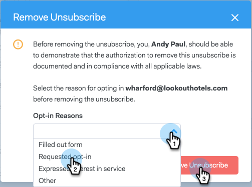

# Cancelar assinatura novamente {#resubscribing-an-unsubscribe}

Às vezes, as pessoas querem optar por receber emails novamente. Veja como tornar as cancelamentos de assinatura acessíveis novamente.

>[!NOTE]
>
>**Permissões de administrador necessárias**

>[!CAUTION]
>
>Antes de reinscrever alguém, você deve ser capaz de demonstrar que a autorização para reinscrevê-lo está documentada e em conformidade com todas as leis aplicáveis.

>[!NOTE]
>
>Se a sincronização de cancelamento de inscrição estiver ativada, remova o cancelamento de inscrição do ToutApp e desmarque a opção de não participação no Salesforce para que o registro de pessoa não seja sincronizado novamente.

1. Vá para o [aplicativo Web](https://toutapp.com/login) e clique em **Pessoas**.

1. Selecione a pessoa para abrir a exibição de detalhes da pessoa.

   

1. Clique nos três pontos na exibição de detalhes da pessoa e selecione **Remover cancelamento de inscrição**.

   

1. Selecione o motivo pelo qual a pessoa está aceitando receber emails novamente e clique em **Remover cancelamento de inscrição**.

   

>[!NOTE]
>
>Se a sincronização de cancelamento de inscrição estiver ativada, você deverá desmarcar a caixa de opção de não participação no registro no Salesforce também, ou a sincronização noturna cancelará a inscrição da pessoa no Sales Connect, pois detectará que a pessoa recusou a inscrição no Salesforce. Se um dos registros for recusado/cancelado, a sincronização marcará o registro vinculado como tal.
