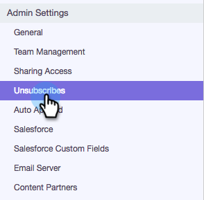

# Sincronizando as assinaturas com o Salesforce {#syncing-unsubscribes-with-salesforce}

## Requisitos para Cancelar a assinatura da sincronização com o Salesforce {#requirements-for-unsubscribes-to-sync-to-salesforce}

* Cancelar inscrição da sincronização deve estar ativada (para sincronização noturna)
* O campo opt out deve ser instalado no Salesforce
* Os registros da pessoa no Sales Connect devem ter uma ID do Salesforce

**Cancelar assinatura de push**

Quando uma cancelamento de assinatura é coletada no Sales Connect, enviamos para o Salesforce em tempo real e atualizamos qualquer um dos campos de Opt out selecionados para sincronização. Se você tiver desativado a sincronização do Salesforce, ainda enviaremos o cancelamento da inscrição para o opt out de email.

**Cancelar assinatura da sincronização**

Ao ativar a sincronização de cancelamento de assinatura (Etapa 3 abaixo), você estará ativando a sincronização noturna. A sincronização ocorre uma vez por dia, por volta das 20h PST. Como opção, ela sincronizará todos os cancelamentos de inscrição no MSE/ToutApp com o campo Opt out no Salesforce.

## Configurar Cancelar assinatura da sincronização com o Salesforce {#configure-unsubscribe-sync-to-salesforce}

Os usuários podem decidir se desejam sincronizar seus cancelamentos de assinatura com o campo Opt out de email padrão com o qual o Marketo também pode sincronizar, ou se podem sincronizar com o campo Opt out de vendas do Marketing para que eles cancelem a assinatura do setor de Vendas e o cancelamento da assinatura do Marketing possa ser diferenciado.

1. Vá para [aplicação Web](http://toutapp.com/login), clique no ícone de engrenagem e selecione **Definições**.

   

1. Em Configurações administrativas, selecione **Cancela a assinatura**.

   

1. Clique em **Sincronizar com o Salesforce** e ative a sincronização noturna.

   

1. Selecione o campo para o qual deseja sincronizar.

   

   | **Sincronizar com o campo Opt out do Salesforce** | Selecionado por padrão, só atualiza o campo Opt out do Salesforce. |
   |---|---|
   | **Sincronizar com o campo Opt out de Vendas do Marketing** | Se você quiser separar as cancelamentos de vendas e marketing, escolha esta opção para atualizar o campo adicional [Opt out de vendas do Marketing to.](#msoo) |

## Instalação do campo Opt out no Layout da página {#installing-the-opt-out-field-in-the-page-layout}

**Opt out de email**

O Opt out de email é um campo padrão no Salesforce que está disponível para instalação a partir do Salesforce. É necessário ser um administrador do Salesforce para instalá-lo.

1. Vá para [Salesforce.com](http://Salesforce.com) e faça logon.

   

1. Clique no seu nome de usuário e selecione **Configuração**.

   

1. Na caixa de busca rápida, procure Contato ou Cliente potencial. Neste cenário, estamos instalando o campo no layout da página Contato, mas você desejará instalar para ambos os registros pessoais.

   

1. Selecione **Layouts de página**.

   

1. Selecione **Editar** ao lado do layout de página ao qual você deseja adicionar o campo.

   

1. Selecione **Campos**.

   

1. Arraste e solte o Opt out Email no layout da página.

   

1. Clique em **Salvar**.

   

## Opt out de Vendas do Marketing {#marketo-sales-opt-out}

O campo Opt out de Vendas do Marketing to é um campo personalizado que está disponível para usuários que instalaram as Personalizações do Marketing to Sales Connect.

Depois que você tiver instalado com êxito as Personalizações do Marketing para Sales Connect no Salesforce, verá o campo Opt out de Vendas do Marketing to disponível para você.
