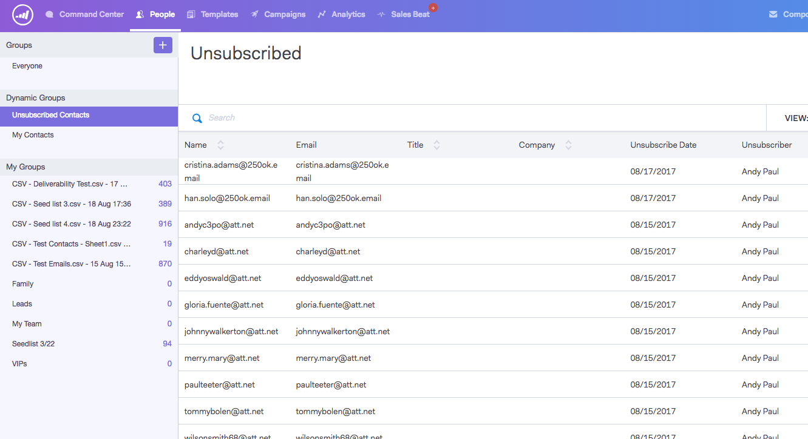

# Cancelar inscrição do grupo {#unsubscribe-group}

Veja e gerencie todas as pessoas que cancelaram sua inscrição em um único local.

Use a barra de pesquisa para procurar pessoas não inscritas.

Se você for um administrador, acesse o grupo de cancelamento de inscrição para filtrar por Cancelamentos de inscrição de conta e ver todas as cancelamentos de inscrição coletadas no banco de dados de pessoas.

