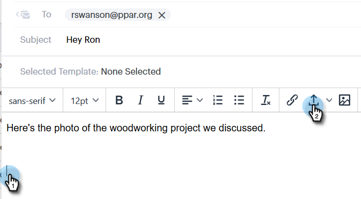

# Adicionar um anexo ou conteúdo rastreável ao seu email {#add-an-attachment-or-trackable-content-to-your-email}

Ao enviar um email por meio do [!DNL Sales Connect], você tem a opção de adicionar um arquivo como anexo ou tornar um arquivo um link baixável (e rastreável).

>[!NOTE]
>
>Normalmente, qualquer arquivo com mais de 20 MB será muito grande para ser entregue. O tamanho de um anexo que você pode enviar por email varia de acordo com o canal de delivery de email que você está usando.

## Adicionar um anexo {#add-an-attachment}

1. Crie seu rascunho de email (há várias maneiras de fazer isso, neste exemplo, estamos escolhendo **[!UICONTROL Compor]** no cabeçalho).

   

1. Preencha o campo [!UICONTROL Para] e insira um [!UICONTROL Assunto].

   

1. Clique no ícone de anexo.

   

1. Selecione o arquivo que deseja anexar e clique em **[!UICONTROL Inserir]**.

   

   >[!NOTE]
   >
   >Se precisar carregar um arquivo, clique no botão **Carregar conteúdo** no canto superior direito da janela.

   

O anexo aparece na parte inferior do email.

## Adicionar conteúdo rastreável {#add-trackable-content}

1. Crie seu rascunho de email (há várias maneiras de fazer isso; neste exemplo, estamos escolhendo a janela [!UICONTROL Compor]).

   

1. Preencha o campo [!UICONTROL Para] e insira um [!UICONTROL Assunto].

   

1. Clique no ponto no e-mail em que deseja que o conteúdo rastreável apareça e clique no ícone de anexo.

   

1. Selecione o conteúdo que você deseja adicionar, clique no controle deslizante **[!UICONTROL Conteúdo é rastreado]** e clique em **[!UICONTROL Inserir]**.

   

   >[!NOTE]
   >
   >Se precisar carregar um arquivo, clique no botão **Carregar conteúdo** no canto superior direito da janela.

   O conteúdo aparece como um link em seu email. O recipient pode clicar no link para baixar o conteúdo.

   

   >[!NOTE]
   >
   >Os usuários serão notificados no Feed ao vivo quando as pessoas estiverem visualizando o conteúdo rastreado. Os usuários também podem ver o conteúdo de maior desempenho na seção de conteúdo da página do Analytics.
