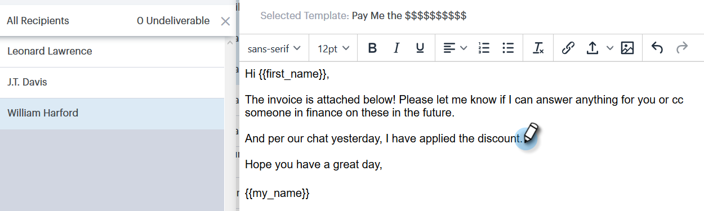

# Escrevendo emails em massa com Selecionar e enviar {#composing-bulk-emails-with-select-and-send}

Veja como enviar/editar emails usando a opção Selecionar e Enviar.

## Enviando e-mails {#sending-emails}

1. Navegue até a página Pessoas.

   

1. Selecione as pessoas para as quais você gostaria de enviar um email.

   

   >[!NOTE]
   >
   >Um máximo de 200 pessoas podem ser selecionadas ao usar Selecionar e enviar.

1. Clique no botão **Email selecionado**.

   

1. Insira uma linha de assunto, selecione um modelo (ou escreva o email do zero) e envie/[agende](/help/marketo/product-docs/marketo-sales-connect/email/using-the-compose-window/scheduling-an-email.md) o email.

   

   >[!NOTE]
   >
   >Se você tiver selecionado um modelo e quiser verificar se todos os campos dinâmicos estão preenchidos corretamente antes de enviar, clique em **Visualizar Campos Dinâmicos**. Verifique se todos os destinatários na barra lateral em massa estão selecionados para visualização para todos os emails. Se você selecionar um email e clicar em **Visualizar Campos Dinâmicos**, somente esse email será visualizado.

## Edição de emails {#editing-emails}

**Edições em massa**

1. Siga as etapas de 1 a 3 da [seção Envio de Emails](#sending-emails).

   >[!NOTE]
   >
   >Todos os recipients serão selecionados por padrão. Se você clicar em um indivíduo e quiser selecionar todos novamente, clique em **Todos os destinatários**. Como lembrete, todos os destinatários devem ser selecionados para fazer edições em massa.

1. Faça as alterações no editor. Você pode criar um novo email ou editar um modelo (neste exemplo, estamos criando um novo email).

   

   >[!NOTE]
   >
   >Você pode clicar em um destinatário de email específico para ver as alterações propagadas para esse email.

1. Clique em **Enviar** (ou [Agendar](/help/marketo/product-docs/marketo-sales-connect/email/using-the-compose-window/scheduling-an-email.md)) para enviar a todos os destinatários as atualizações de email em massa que você fez.

   

**Editar Cada Email**

Conclua as Atualizações em massa antes de personalizar cada email, pois fazer uma atualização em massa substitui as alterações em cada email na barra lateral de composição em massa.

1. Siga as etapas de 1 a 4 da [seção Envio de Emails](#sending-emails).

   >[!NOTE]
   >
   >Todos os recipients serão selecionados por padrão. Se você clicar em um indivíduo e quiser selecionar todos novamente, clique em **Todos os destinatários**. Como lembrete, todos os destinatários devem ser selecionados para fazer edições em massa.

1. Selecione um recipient individual.

   

1. Faça as alterações no editor.

   

   >[!NOTE]
   >
   >É aqui que você pode fazer edições em um único email na barra lateral em massa sem atualizar o restante dos emails.

   >[!TIP]
   >
   >Você pode clicar em outros destinatários para ver que as alterações feitas no destinatário selecionado anteriormente não estão sendo exibidas.

1. Clique em **Enviar** (ou [Agendar](/help/marketo/product-docs/marketo-sales-connect/email/using-the-compose-window/scheduling-an-email.md)) para enviar a todos os destinatários as atualizações de email em massa que você fez.

   

   >[!MORELIKETHIS]
   >
   >* [Opções de envio em massa](/help/marketo/product-docs/marketo-sales-connect/email/using-the-compose-window/bulk-sending-options.md)
   >* [Usando um Modelo na Janela de Composição](/help/marketo/product-docs/marketo-sales-connect/email/using-the-compose-window/using-a-template-in-the-compose-window.md)
   >* [Campos Dinâmicos](/help/marketo/product-docs/marketo-sales-connect/templates/dynamic-fields/how-to-insert-dynamic-fields.md)
