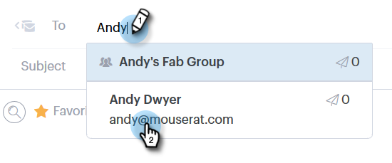

# Enviar um email rastreado {#sending-a-tracked-email}

Ao enviar um email com [!DNL Marketo Sales Connect], os modos de exibição (aberturas de email) e os cliques (links clicados) serão rastreados.

>[!PREREQUISITES]
>
>Você precisará ter uma identidade verificada e um canal de entrega de email configurado antes de enviar um email rastreado.
>
>* [Verificar seu endereço de email](/help/marketo/product-docs/marketo-sales-connect/getting-started/email-settings/verify-your-email.md)
>* Configure um Canal de Entrega para [[!DNL Outlook]](/help/marketo/product-docs/marketo-sales-connect/email-plugins/msc-for-outlook/email-connection-for-outlook-users.md) ou [Gmail](/help/marketo/product-docs/marketo-sales-connect/email-plugins/gmail/email-connection-for-gmail-users.md)

1. Crie seu rascunho de email (há várias maneiras de fazer isso, neste exemplo, estamos escolhendo **[!UICONTROL Compor]** no cabeçalho).

   

1. Insira o nome ou email de um destinatário no campo **[!UICONTROL Para]**.

   

   >[!NOTE]
   >
   >Você só pode ter uma pessoa no campo **[!UICONTROL Para]**.

1. Adicione todos os recipients que você deseja CC ou CCO nos respectivos campos.

   

   >[!NOTE]
   >
   >Se alguém que foi CC ou CCO abrir o email, essa abertura será registrada como uma exibição no registro da pessoa no campo **[!UICONTROL Para]**.

1. Adicione uma linha de assunto.

   

   >[!NOTE]
   >
   >Uma linha de assunto e um destinatário são necessários para enviar o email. Vamos **salvar automaticamente seu rascunho** assim que uma linha de assunto e um destinatário forem adicionados.

1. Redija o email usando o editor. Clique em **[!UICONTROL Enviar]** (ou [Agendar](/help/marketo/product-docs/marketo-sales-connect/email/using-the-compose-window/scheduling-an-email.md), se preferir) quando terminar.

   

   >[!MORELIKETHIS]
   >
   >* [Agendando um Email](/help/marketo/product-docs/marketo-sales-connect/email/using-the-compose-window/scheduling-an-email.md)
   >* [Modelos](/help/marketo/product-docs/marketo-sales-connect/templates/manage-templates.md)
