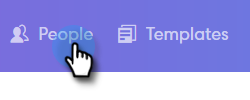

# Enviando Emails por Email de Grupo {#sending-emails-via-group-email}

Veja como enviar/editar emails usando a opção Email de grupo.

## Enviando um email de grupo {#sending-a-group-email}

1. Clique na guia **[!UICONTROL Pessoas]**.

   

1. Selecione o grupo para o qual deseja enviar um email.

   

1. Clique no botão [!UICONTROL Ações de Grupo] e selecione **[!UICONTROL Grupo de Emails]**.

   

1. Preencha o email (ou selecione um modelo) e envie (ou programe).

   

## Editar um email de grupo {#editing-a-group-email}

1. Crie um email de grupo usando as [Etapas 1-3 acima](#sending-a-group-email).

1. Escolha um modelo ou preencha seu email.

   

1. Com o email concluído, agora é possível visualizar cada email na lista para ver se os campos dinâmicos estão sendo preenchidos corretamente.

   

1. Selecione o recipient desejado.

   

1. Clique em **[!UICONTROL Visualizar Campos Dinâmicos]** e exiba a visualização à direita.

   

   >[!NOTE]
   >
   >Você pode fazer edições em massa no email/modelo ao enviar um email de grupo, mas não pode fazer edições exclusivas para destinatários específicos na lista.

>[!MORELIKETHIS]
>
>* [Opções de envio em massa](/help/marketo/product-docs/marketo-sales-connect/email/using-the-compose-window/bulk-sending-options.md)
>* [Usando um Modelo na Janela de Composição](/help/marketo/product-docs/marketo-sales-connect/email/using-the-compose-window/using-a-template-in-the-compose-window.md)
