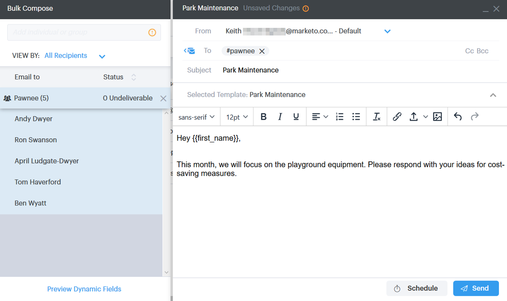
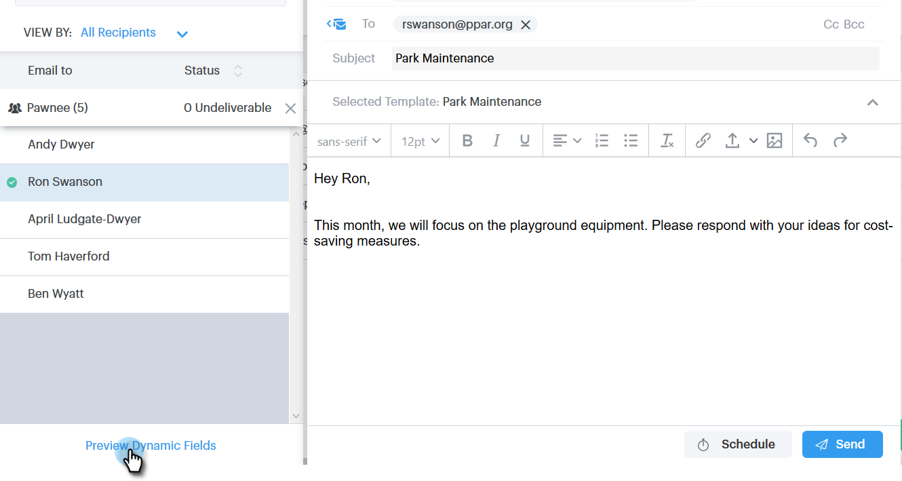

# Enviar emails por email de grupo {#sending-emails-via-group-email}

Veja como enviar/editar emails usando a opção Agrupar email .

## Envio de um email de grupo {#sending-a-group-email}

1. Clique no botão **Pessoas** guia .

   

1. Selecione o grupo que deseja enviar por email.

   

1. Clique no botão Ações do grupo e selecione **Grupo de email**.

   

1. Preencha o email (ou selecione um template) e envie (ou agende).

   

## Editar um email de grupo {#editing-a-group-email}

1. Criar um email de grupo usando [Etapas 1-3 acima](#sending-a-group-email).

1. Escolha um modelo ou preencha seu email.

   

1. Com o email concluído, agora é possível visualizar cada email na lista para ver se os campos dinâmicos estão sendo preenchidos corretamente.

   

1. Selecione o recipient desejado.

   

1. Clique em **Visualizar campos dinâmicos** e visualize a visualização à direita.

   

   >[!NOTE]
   >
   >Você pode fazer edições em massa no email/modelo ao enviar um email de grupo, mas não pode fazer edições exclusivas para recipients específicos na lista.

>[!MORELIKETHIS]
>
>* [Opções de envio em massa](/help/marketo/product-docs/marketo-sales-connect/email/using-the-compose-window/bulk-sending-options.md)
>* [Usando um modelo na janela Compor](/help/marketo/product-docs/marketo-sales-connect/email/using-the-compose-window/using-a-template-in-the-compose-window.md)

