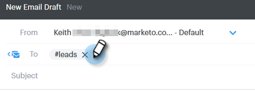
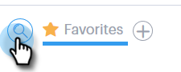
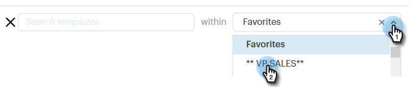
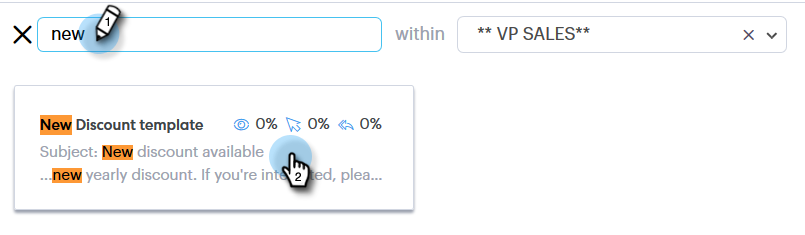
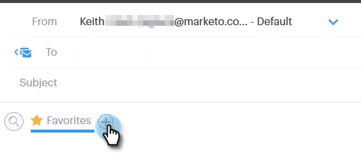
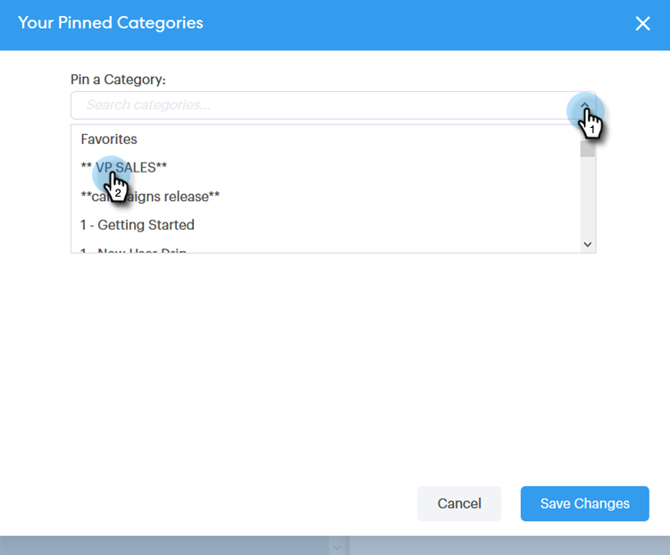
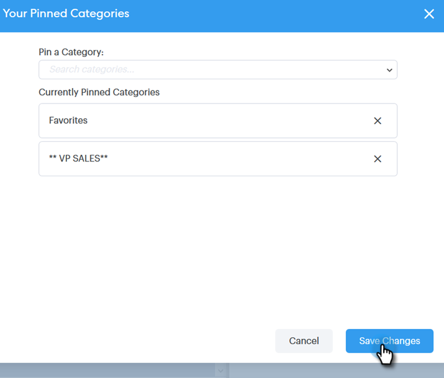
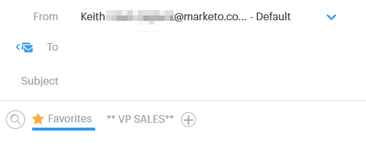

# Uso de um modelo na janela Compor {#using-a-template-in-the-compose-window}

## Localização e uso de modelos {#finding-and-using-templates}

1. Crie seu rascunho de email (há várias maneiras de fazer isso, neste exemplo, estamos escolhendo **[!UICONTROL Compor]** no cabeçalho).

   

1. Preencha o campo [!UICONTROL Para].

   

1. Clique no ícone de pesquisa na seção template para abrir o campo de pesquisa do template.

   

1. Selecione uma categoria para pesquisar (ou selecione Tudo para pesquisar em todas as categorias).

   

1. Pesquise por nome do template, linha de assunto ou corpo do email. Clique no modelo desejado para selecioná-lo.

   

   >[!NOTE]
   >
   >Selecionar outro modelo substituirá todas as informações atualmente no editor. Se você fizer alterações, copie-as antes de selecionar outro modelo.

## Fixando Categorias de Modelo na Janela Compor {#pinning-template-categories-in-the-compose-window}

Marque **até cinco** categorias de modelo específicas para obter acesso rápido aos modelos mais usados.

1. Crie seu rascunho de email (há várias maneiras de fazer isso, neste exemplo, estamos escolhendo **[!UICONTROL Compor]** no cabeçalho).

   

1. Clique no ícone **+** ao lado de [!UICONTROL Favoritos].

   

1. Clique no menu suspenso **[!UICONTROL Fixar uma Categoria]** e selecione a categoria desejada.

   

1. Clique em **[!UICONTROL Salvar alterações]** quando terminar (opcional: repita a Etapa 3 para adicionar mais).

   

   >[!TIP]
   >
   >Você pode reorganizar suas categorias fixadas simplesmente arrastando e soltando antes de salvar as alterações.

   

   >[!NOTE]
   >
   >Por padrão, **[!UICONTROL Favoritos]** estão lá. Ele contém templates de email favoritos, não categorias.

   A categoria selecionada agora está fixada.
