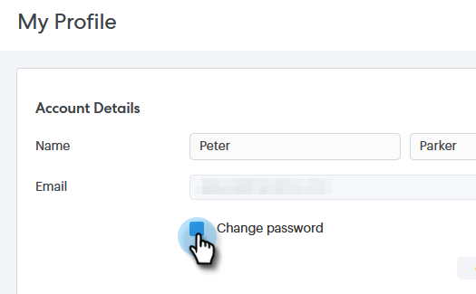

# Alterar a senha do Sales Connect {#change-your-sales-connect-password}

Precisa alterar sua senha? Veja como.

## Alterar Sua Senha Ao Entrar {#change-your-password-while-signed-in}

1. Clique no ícone de engrenagem e selecione **[!UICONTROL Configurações]**.

   

1. A página [!UICONTROL Meu Perfil] é aberta por padrão. Em [!UICONTROL Detalhes da Conta], marque a caixa de seleção **[!UICONTROL Alterar senha]**.

   

1. Digite sua senha atual. Em seguida, insira o novo e digite-o novamente, certificando-se de que ele corresponde. Clique em **[!UICONTROL Salvar]** quando terminar.

   

>[!NOTE]
>
>As senhas devem:
>
>* Ter pelo menos nove caracteres
>* Usar mistura de maiúsculas e minúsculas (tanto MAIÚSCULAS quanto MINÚSCULAS)
>* Incluir um número
>* Usar um caractere especial

## Alterar a senha ao sair {#change-your-password-while-signed-out}

1. Navegue até a página [Login do Sales Connect](https://toutapp.com/login) e clique em **[!UICONTROL Esqueceu a senha?]**.

   

1. Digite o endereço de email associado à conta e clique em **[!UICONTROL Enviar email de redefinição]**.

   

1. Enviaremos um email para verificar se o proprietário da conta deseja alterar a senha. Clique em **[!UICONTROL Redefinir senha]**.

   

   >[!NOTE]
   >
   >Certifique-se de verificar sua pasta de spam também, pois esse e-mail pode, às vezes, acabar lá.

1. Digite e confirme sua nova senha. Clique em **[!UICONTROL Definir senha]** quando terminar.

   
