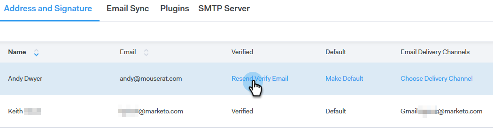

# Verificar seu e-mail {#verify-your-email}

Se você tiver uma identidade de email que não foi verificada, siga as etapas abaixo.

1. Clique no ícone de engrenagem na parte superior direita e escolha **Configurações**.

   

1. Em Minha conta, clique em **Configurações de email**.

   

1. Em Endereço e Assinatura, encontre a identidade de email que você deseja verificar e clique em **Reenviar Verificar Email**. Um novo email de verificação será enviado.

   

1. Clique em **Reenviar**.

   

1. O recipient abre o email e segue as etapas para verificar a identidade do email.

   
