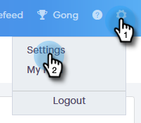

# Gerenciar seu perfil {#manage-your-profile}

Na página [!UICONTROL Meu Perfil], você pode atualizar seu nome, o idioma/localidade/fuso horário de sua conta e também alterar sua senha.

## Detalhes da conta {#account-details}

Aqui você pode atualizar seu nome e/ou senha.

1. Clique no ícone de engrenagem e selecione **[!UICONTROL Configurações]**.

   

1. A página Meu perfil é aberta por padrão. Para atualizar seu nome, basta digitar as alterações e clicar em **[!UICONTROL Salvar]**.

   

>[!NOTE]
>
>Seu endereço de email está definido para exibição somente. Se você também precisar alterar isso, contate o [Suporte da Marketo](https://nation.marketo.com/t5/Support/ct-p/Support).

Você também pode alterar sua senha nesta seção. As etapas são descritas neste documento.

## Suas integrações {#your-integrations}

No lado direito da página, a seção [!UICONTROL Suas integrações] fornece o status de todas as conexões da sua conta.

>[!NOTE]
>
>Se você estiver usando o Exchange no local com o Sales Connect, ele não atualizará as verificações de integridade da integração do Canal de entrega (primeiro item de linha) ou do Rastreamento de resposta (segundo item de linha). Estamos trabalhando para oferecer suporte a isso em uma versão futura.

## Fuso horário {#time-zone}

Veja como alterar o idioma, a localidade e/ou o fuso horário de sua conta.

>[!NOTE]
>
>Idiomas suportados: inglês, francês, alemão, japonês, português, espanhol.

1. Clique no ícone de engrenagem e selecione **[!UICONTROL Configurações]**.

   

1. Para alterar o idioma, clique no menu suspenso **[!UICONTROL Idioma]** e faça sua escolha.

   

1. Localidade aqui refere-se à região em que o idioma é falado. Clique no menu suspenso **[!UICONTROL Local]** e faça sua escolha.

   

1. Clique na lista suspensa **[!UICONTROL Seu fuso horário]** e faça sua escolha.

   

1. Clique em **[!UICONTROL Salvar]** quando terminar.

   

Et voilà!
