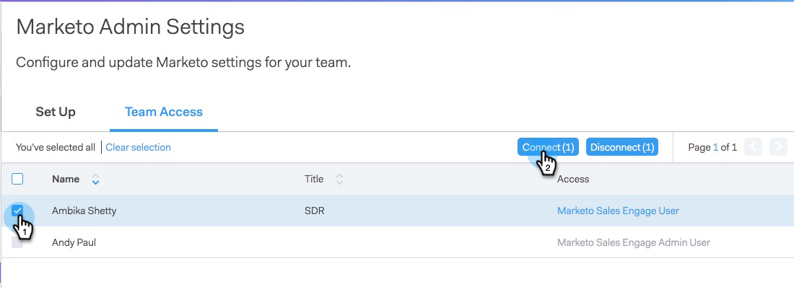
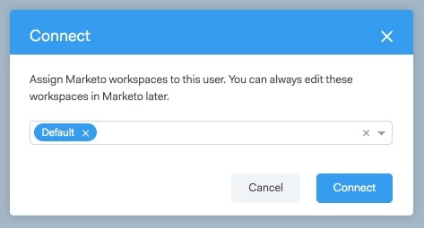

# Conceder acesso a usuários {#granting-access-to-users}

Siga as etapas deste artigo para conceder aos usuários do [!DNL Sales Connect] acesso à conexão do Marketo. Isso desbloqueará recursos como Momentos interessantes no Feed ao vivo e acesso a Campanhas de marketing.

Você precisará convidar usuários para [!DNL Sales Connect] [aqui](/help/marketo/product-docs/marketo-sales-connect/admin/invite-users.md), antes que eles fiquem visíveis na página Marketo > [!UICONTROL Acesso à Equipe] (em [!DNL Sales Connect]), onde o acesso à conexão Marketo é concedido.

>[!CAUTION]
>
>Aguarde dez minutos após a conexão do [!DNL Sales Connect] com o Marketo antes de executar essas etapas.

1. Selecione um ou mais usuários e clique em **[!UICONTROL Conectar]**.

   >[!NOTE]
   >
   >Você só pode fazer a atribuição do espaço de trabalho uma vez no momento da concessão de acesso aos usuários. Depois de definido, é necessário desconectar o usuário para alterá-lo.

   

1. Se a assinatura do Marketo tiver espaços de trabalho habilitados, você poderá atribuir espaços de trabalho a cada usuário ou conjunto de usuários em massa. Se nenhum espaço de trabalho for selecionado, nós os atribuiremos ao espaço de trabalho Padrão do Marketo.

   

1. Clique na lista suspensa Workspace, selecione o(s) espaço(s) de trabalho desejado(s) e clique em **[!UICONTROL Conectar]**.

   

Você pode adicionar outros usuários da página Gerenciamento de Equipe e seguir as etapas acima para conectá-los.
