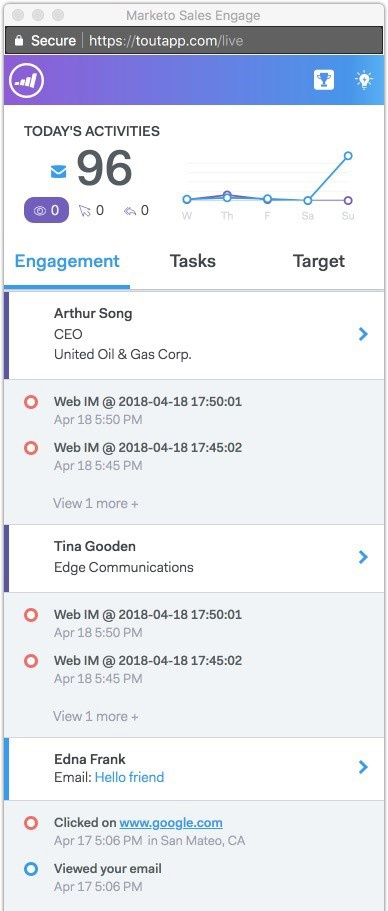

# Momentos interessantes em [!DNL Sales Connect] {#interesting-moments-in-sales-connect}

Momentos interessantes são a chave para se comunicar com sua equipe de vendas através do [!DNL Marketo Sales Connect].

>[!AVAILABILITY]
>
>Estes estão disponíveis somente para [Marketo Sales Insight](/help/marketo/product-docs/marketo-sales-insight/msi-for-salesforce/features/tabs-in-the-msi-panel/interesting-moments/using-interesting-moments.md) e [!DNL Marketo Sales Connect] clientes.

>[!PREREQUISITES]
>
>* Você deve ter uma [conexão com o Salesforce CRM](/help/marketo/product-docs/marketo-sales-connect/crm/salesforce-integration/connect-your-sales-connect-account-to-salesforce.md){target="_blank"}
>* Você deve ser o proprietário do cliente em potencial ou contato no Salesforce
>* Você deve ter acesso a [conceder acesso à conexão do Marketo Engage](/help/marketo/product-docs/marketo-sales-connect/marketo/granting-access-to-users.md){target="_blank"}

## O que é um momento interessante? {#what-is-an-interesting-moment}

Isso depende de você! Você decide quais informações são relevantes para sua equipe de vendas. Sua equipe de vendas pode querer saber quando um lead:

* Visita a página de preços no seu site
* Cliques em um link em um novo email de anúncio do produto
* Solicita uma demonstração do produto

## Como criar um momento interessante? {#how-do-i-create-an-interesting-moment}

1. Escolha uma [campanha inteligente](/help/marketo/product-docs/core-marketo-concepts/smart-campaigns/understanding-smart-campaigns.md), de preferência uma que sua equipe de vendas achará interessante se for acionada.

   

1. Arraste sobre a etapa de fluxo **[!UICONTROL Momentos interessantes]**.

   

1. Selecione um **tipo** ([!UICONTROL Email], [!UICONTROL Marco] ou [!UICONTROL Web]).

   

1. Escreva uma mensagem para sua equipe de vendas no campo **[!UICONTROL Descrição]** que explique por que essa ação é importante.

   

   >[!NOTE]
   >
   >O Marketo também adicionará a data em que ocorreu e como o momento interessante foi adicionado (ou seja, ação principal > etapa de fluxo, API do SOAP).

## Como se parece um momento interessante no Marketo?  {#what-does-an-interesting-moment-look-like-in-marketo}

Momentos interessantes serão exibidos em um [log de atividades do cliente potencial](/help/marketo/product-docs/core-marketo-concepts/smart-lists-and-static-lists/managing-people-in-smart-lists/using-the-person-detail-page.md).

## Como se parece um momento interessante em [!DNL Sales Connect]? {#what-does-an-interesting-moment-look-like-in-sales-connect}

Momentos interessantes serão exibidos em tempo real no Feed ativo de um usuário. Utilizamos a ID de proprietário do cliente potencial no [!DNL Salesforce] para mostrar aos usuários os momentos interessantes de clientes potenciais relevantes dos quais eles são proprietários. Os usuários podem acompanhar rapidamente com clientes potenciais por email/telefone/campanha de vendas clicando na lista suspensa ao lado do nome do cliente potencial.

