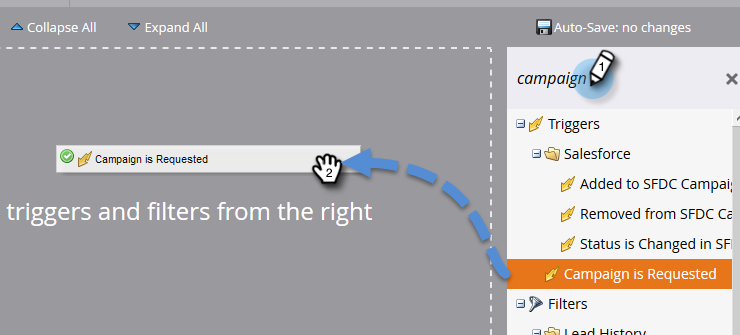
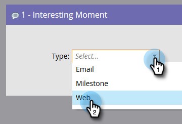

# Tornar uma campanha visível para os usuários do Sales Connect {#make-a-campaign-visible-to-sales-connect-users}

As campanhas só podem ser compartilhadas se estiverem visíveis. Veja como fazer isso.

1. Selecione (ou crie) a Campanha que deseja compartilhar.

   

1. Clique na guia **Smart List**.

   

1. Adicione o acionador Campanha solicitada.

   

1. Para origem, escolha &quot;is&quot; **API de Serviço da Web**.

   

1. Clique na guia **Fluxo**.

   

1. Adicione a ação de fluxo Momento interessante.

   

1. Para Tipo, selecione **Web**.

   

1. Na caixa Descrição, escreva uma mensagem para a equipe de vendas. Neste exemplo, estamos usando tokens para especificar o formulário que foi preenchido.

   

1. Clique na guia **Agendar** e **Ativar** a campanha.

   
