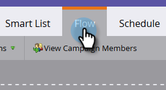
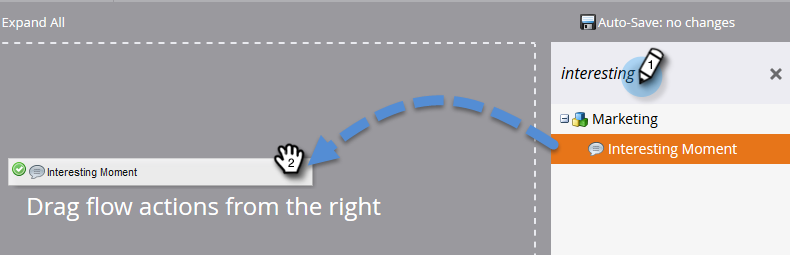

# Tornar uma campanha visível para [!DNL Sales Connect] usuários {#make-a-campaign-visible-to-sales-connect-users}

As campanhas só podem ser compartilhadas se estiverem visíveis. Veja como fazer isso.

1. Selecione (ou crie) a Campanha que deseja compartilhar.

   

1. Clique na guia **[!UICONTROL Smart List]**.

   

1. Adicione o acionador [!UICONTROL Campanha solicitada].

   

1. Para a origem, escolha &quot;[!UICONTROL is]&quot; **[!UICONTROL API de Serviço Web]**.

   

1. Clique na guia **[!UICONTROL Fluxo]**.

   

1. Adicione a ação de fluxo [!UICONTROL Momento interessante].

   

1. Para [!UICONTROL Type], selecione **[!UICONTROL Web]**.

   

1. Na caixa [!UICONTROL Descrição], escreva uma mensagem para a equipe de vendas. Neste exemplo, estamos usando tokens para especificar o formulário que foi preenchido.

   

1. Clique na guia **[!UICONTROL Agendar]** e **[!UICONTROL Ativar]** a campanha.

   
