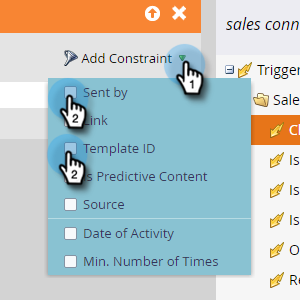

# Acionadores e filtros da atividade de vendas {#sales-activity-triggers-and-filters}

Se você estiver procurando coordenar melhor o envolvimento com sua equipe de vendas ou tentar obter uma visão melhor de como eles estão se envolvendo com os clientes na jornada do comprador, os Insights de atividade de vendas no Marketo serão úteis para você.

Siga as etapas abaixo para saber como utilizar filtros e acionadores de atividade de vendas em suas campanhas inteligentes.

1. Localize e selecione a Campanha inteligente desejada.

   

1. Na guia **Smart List**, pesquise &quot;Aplicativos de Vendas&quot;.

   

1. Selecione e arraste sobre o filtro ou acionador desejado.

   

1. Selecione quaisquer restrições desejadas.

   

>[!NOTE]
>
>Para obter uma lista completa de atividades, restrições e definições, consulte nosso [Glossário de Atividades de Vendas](/help/marketo/product-docs/marketo-sales-connect/marketo/sales-activity-glossary.md).
