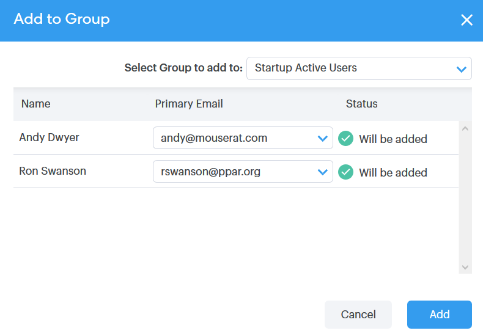

# Ações em massa em pessoas {#bulk-actions-on-people}

Você pode fazer algumas coisas com seus contatos em massa para economizar tempo.

A primeira etapa para todas as ações em massa disponíveis é selecionar dois ou mais contatos e clicar no ponto (três pontos verticais).

## Adicionar pessoas ao grupo {#add-people-to-group}

Adicionar várias pessoas a um grupo ao mesmo tempo.

## Origem {#source}

Atribuímos automaticamente uma fonte a cada contato que entra no banco de dados. Use esta etapa para atualizar essa origem.

>[!NOTE]
>
>As fontes não são personalizáveis.

## Autorização {#authorization}

Em conformidade com o [GDPR](https://eugdpr.org/), use a autorização para indicar como você recebeu permissão para se envolver com esses contatos.

## Cancelar inscrição {#unsubscribe}

Faça um cancelamento de inscrição em massa nos contatos que não desejam mais receber sua correspondência.

## Excluir {#delete}

Excluir contatos em massa. Etapas completas podem ser encontradas [aqui](/help/marketo/product-docs/marketo-sales-connect/people/managing-contacts/creating-and-deleting-contacts.md).

