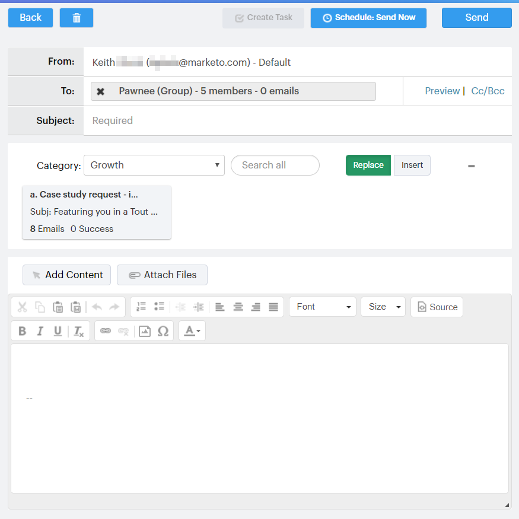

# Conexão com um grupo {#connecting-with-a-group}

Saiba como enviar um email para um grupo inteiro ou adicionar um grupo a uma campanha.

## Ação do grupo: Email {#group-action-email}

1. Selecione o grupo que deseja enviar por email.

   

1. Clique no botão Ações **do** grupo e selecione Grupo **de** email.

   

1. Preencha seu email e agende/envie.

   

   E é isso. Todos nesse grupo receberão o email.

## Ação do grupo: Adicionar à Campanha de Vendas {#group-action-add-to-sales-campaign}

1. Selecione o grupo que deseja adicionar a uma campanha.

   

1. Clique no botão Ações **do** grupo e selecione **Adicionar grupo à Campanha**.

   

1. Confirme se as pessoas certas foram selecionadas e clique em **Avançar**.

   

   >[!NOTE]
   >
   >Você pode ver uma opção para adicionar a uma Campanha de marketing. [Esse é um artigo](http://docs.marketo.com/x/CwDh)diferente.

1. Selecione uma campanha (você pode selecionar uma categoria para restringir os resultados) e clique em **Avançar**.

   

1. Faça as edições desejadas e clique em **Avançar**.

   

1. Agende a campanha e clique em **Start**.

   

