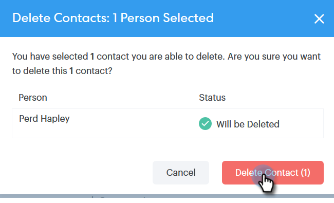

# Criar e excluir contatos {#creating-and-deleting-contacts}

## Criando Contatos {#creating-contacts}

1. Na página [!UICONTROL Pessoas], clique no botão **[!UICONTROL Ações de Grupo]** e selecione **[!UICONTROL Criar Contato]**.

   

1. Insira o nome/sobrenome e o endereço de email, juntamente com qualquer outra informação que desejar. Clique em **[!UICONTROL Criar]** quando terminar ou em **[!UICONTROL Criar e Adicionar Novo]** para adicionar mais contatos.

   

   >[!TIP]
   >
   >Deseja adicionar vários contatos de uma só vez? [Clique aqui](/help/marketo/product-docs/marketo-sales-connect/people/managing-contacts/import-contacts-via-csv.md) para saber como importar contatos via CSV.

## Excluindo Contatos {#deleting-contacts}

1. Na página [!UICONTROL Pessoas], marque a caixa do contato que você deseja excluir.

   

   >[!NOTE]
   >
   >Para excluir vários contatos, basta selecionar várias pessoas. As etapas restantes seriam as mesmas.

1. Clique nos dados (três pontos verticais) e selecione **[!UICONTROL Excluir]**.

   

1. Clique em **[!UICONTROL Excluir Contato]** para confirmar.

   
