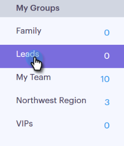

# Importar contatos via CSV {#import-contacts-via-csv}

Ter contatos na página [!UICONTROL Pessoas] é importante porque é de onde extraímos para preencher automaticamente informações personalizadas nos campos dinâmicos dos seus modelos. Certifique-se de que você tenha pelo menos um nome e um endereço de email para cada contato em seu CSV e que você mapeie para esses campos.

1. Selecione seu grupo (ou crie um novo) na guia [!UICONTROL Pessoas].

   

1. Clique em **[!UICONTROL Ações de Grupo]** e selecione **[!UICONTROL Importar de CSV]**.

   

1. Clique em **[!UICONTROL Procurar]**.

   

1. Localize o arquivo no computador e selecione-o.

   >[!NOTE]
   >
   >Os grupos são limitados a 1000 contatos.

1. Clique em **[!UICONTROL Avançar]**.

   

1. Mapeie as colunas em seu CSV para seus respectivos campos no [!DNL Sales Connect]. Clique em **[!UICONTROL Avançar]** quando terminar.

   
