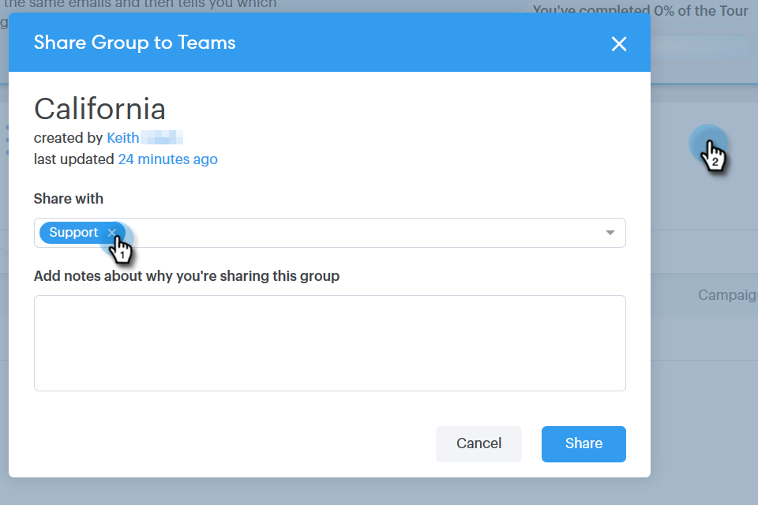

# Gerenciar grupos {#manage-groups}

Saiba como gerenciar grupos no [!DNL Sales Connect].

## Criar um grupo {#create-a-group}

1. Na página [!UICONTROL Pessoas], clique em **+** ao lado de [!UICONTROL Grupos].

   

1. Nomeie seu grupo e clique em **[!UICONTROL Criar]**.

   

   Pronto!

## Adicionar contatos a um grupo {#add-contacts-to-a-group}

1. Na página [!UICONTROL Pessoas], localize e selecione o grupo ao qual deseja adicionar pessoas.

   

1. Clique em **[!UICONTROL Ações do Grupo]** e selecione **[!UICONTROL Criar Contato]**.

   

   >[!NOTE]
   >
   >Isso adicionará um contato de cada vez. Para adicionar vários contatos ao mesmo tempo, siga [estas etapas](/help/marketo/product-docs/marketo-sales-connect/people/managing-contacts/import-contacts-via-csv.md).

1. Preencha as informações do contato e clique em **[!UICONTROL Criar]** (ou **[!UICONTROL Criar e Adicionar Novo]** para adicionar outro).

   

   E pronto!

   >[!NOTE]
   >
   >Talvez seja necessário clicar em atualizar para ver os novos contatos adicionados.

## Compartilhar um grupo {#share-a-group}

1. Na página [!UICONTROL Pessoas], localize e selecione o grupo que deseja compartilhar.

   

1. Clique nos dados (três pontos verticais) e selecione **[!UICONTROL Compartilhar]**.

   

1. Clique no menu suspenso e escolha a equipe com a qual deseja compartilhar o grupo.

   

1. Clique em **[!UICONTROL Compartilhar]**.

   

   Você ainda é o proprietário do grupo, mas ele agora aparecerá em [!UICONTROL Grupos de Equipe].

## Deixar de compartilhar um grupo {#unshare-a-group}

1. Na página [!UICONTROL Pessoas], localize e selecione o grupo que deseja cancelar o compartilhamento.

   

1. Clique nos dados (três pontos verticais) e selecione **[!UICONTROL Compartilhar]**.

   

1. Clique no **X** ao lado da equipe com a qual você compartilhou o grupo e clique fora do modal.

   

   O grupo agora não está compartilhado.

## Renomear um grupo {#rename-a-group}

1. Na página [!UICONTROL Pessoas], localize e selecione o grupo que deseja renomear.

   

1. Clique nos dados (três pontos verticais) e selecione **[!UICONTROL Renomear]**.

   

1. Digite o novo nome e pressione Enter.

   

## Excluir um grupo {#delete-a-group}

1. Na página [!UICONTROL Pessoas], localize e selecione o grupo que deseja excluir.

   

1. Clique nos dados (três pontos verticais) e selecione **[!UICONTROL Excluir]**.

   

1. Clique em **[!UICONTROL Excluir]** para confirmar.

   
