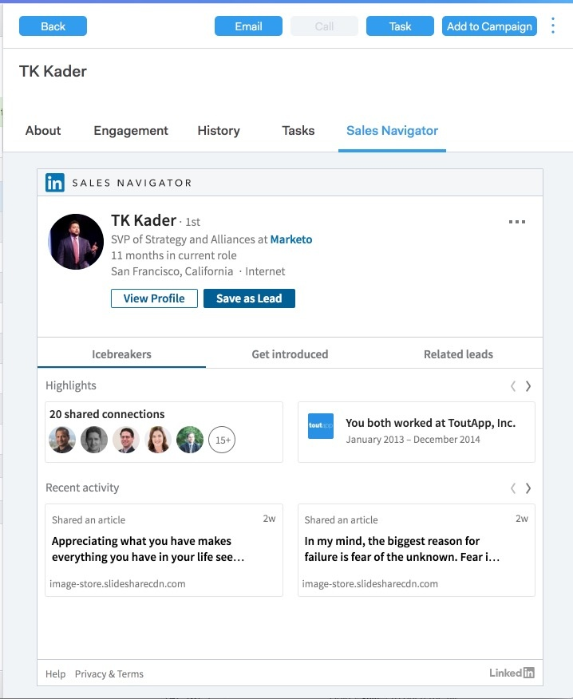

# Visualização de detalhes da pessoa {#person-detail-view}

A visualização de detalhes da pessoa fornece um perfil detalhado de cada pessoa em sua conta MSC.

## Como acessar {#how-to-access}

1. Para acessar a visualização de detalhes da pessoa, clique na guia **Pessoas** .

   

1. Clique na pessoa desejada.

   

   >[!TIP]
   >
   >Em qualquer lugar que você veja o nome de uma pessoa, você pode clicar nele e acessar a Visualização de detalhes da pessoa.

## Guia Sobre {#about-tab}

Inclui todas as informações de contato da pessoa.

**Cartão de contato**

* Contém informações de contato como: endereço de email, nome, empresa, título, número de telefone e links de redes sociais

**Grupos**

* Exibe e gerencia quais grupos essa pessoa é membro

**Informações da conta**

* Pode adicionar uma pessoa ao Salesforce
* Obter informações de conta e cliente potencial/contato do Salesforce

**Campos personalizados**

* Adicionar ou remover campos personalizados que podem ser usados como campos dinâmicos em seus modelos e campanhas

**Notas**

* Criar notas personalizadas

## Guia Envolvimento {#engagement-tab}

Veja como essa pessoa está se envolvendo com seu alcance.

**Atividade do Sales Connect**

* Veja atividades de envolvimento de seus emails de vendas e campanhas

**Atividade de marketing**

* Veja como sua pessoa está se envolvendo com campanhas de marketing

## Guia Histórico {#history-tab}

Mostra seu histórico de alcance. Inclui emails, campanhas e chamadas.

**Campanhas de vendas**

* Ver quaisquer campanhas ativas ou concluídas às quais esta pessoa pertence

**Campanhas de marketing**

* Veja quaisquer campanhas de marketing de que esta pessoa é membro

**E-mails de vendas**

* Veja todos os emails que você enviou a esta pessoa e as métricas de envolvimento

**Chamadas de vendas**

* Ver chamadas que você fez para esta pessoa

## Guia Tarefa {#tasks-tab}

Gerenciar tarefas associadas a essa pessoa.

Ações que podem ser executadas:

* Editar ou excluir uma tarefa
* Ver a data de vencimento
* Clique em Tipo para iniciar o Telefone de vendas se Chamar, Enviar por e-mail para Compor se for E-mail, Vincular se for Email e Fazer uma observação personalizada se for Personalizado.
* Marcar uma tarefa como concluída

## Guia Navegador de Vendas {#sales-navigator-tab}

Visualização de dados do perfil do LinkedIn com o Navegador de vendas do LinkedIn.

>[!NOTE]
>
>O Navegador de vendas é um complemento pago pelo LinkedIn. Entre em contato com eles para obter esse recurso.

Mencionadores de ícones para criar um relatório.

Salve contatos como clientes potenciais no Navegador de vendas.
