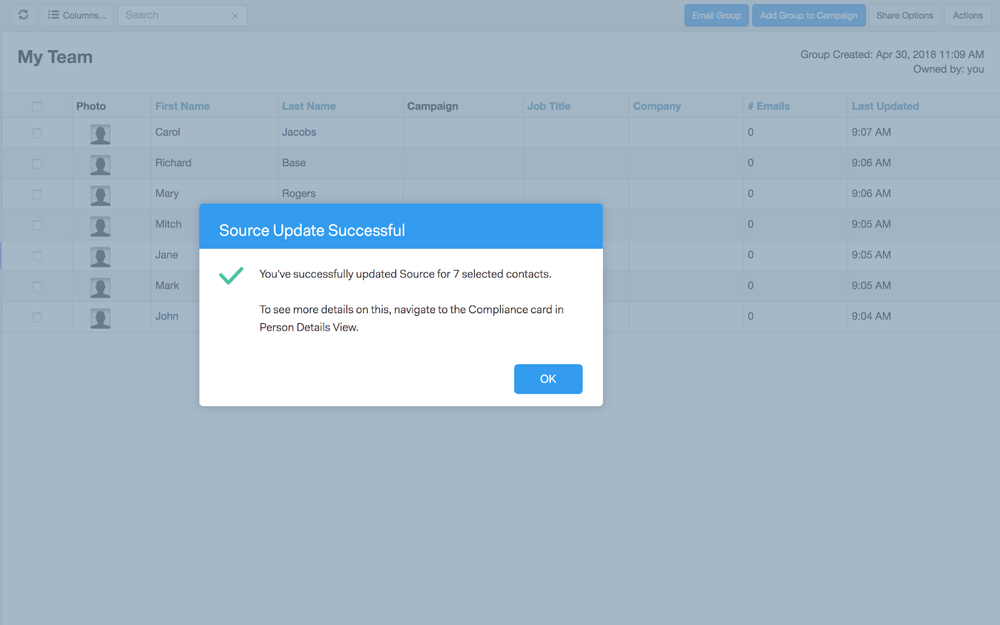

# Conformidade com o Sales Connect e o GDPR {#sales-connect-and-gdpr-compliance}

O Regulamento Geral de Proteção de Dados (RGPD) é a legislação europeia de Uniões que entrou em vigor em 25 de maio de 2018.

## Visão geral {#overview}

O seu objetivo é reforçar os direitos das pessoas em causa na União Europeia (UE) e no Espaço Econômico Europeu (EEE) no que respeita à forma como os seus dados pessoais são utilizados e protegidos. &quot;Dados pessoais&quot;, qualquer informação relacionada com uma pessoa singular identificada ou identificável.

O RGPD está estruturado em torno de seis princípios - chave (descritos no artigo 5 º da legislação):

1. Transparência sobre a forma como os dados serão utilizados e para que serão utilizados.
1. Garantir que os dados recolhidos sejam utilizados apenas para os fins explicitamente especificados no momento da recolha.
1. Limitar a recolha de dados ao que é necessário para atingir a finalidade para a qual é recolhida.
1. Garantir a precisão dos dados.
1. Armazenar os dados apenas durante o tempo necessário para o fim a que se destina.
1. Prevenção contra a utilização não autorizada ou perda acidental de dados através da aplicação de medidas de segurança adequadas.

Além disso, há um novo requisito de responsabilidade para ser capaz de demonstrar como a conformidade está sendo gerenciada e rastreada. Isso significa manter registros de como e por que os dados pessoais foram recolhidos, bem como a documentação dos processos criados para os proteger.

## A Quem Se Aplica? {#to-whom-does-it-apply}

O RGPD aplica-se a qualquer organização dentro ou fora da UE que comercialize bens ou serviços e/ou rastreie os comportamentos das pessoas em causa na UE e no EEE. Se você negociar com pessoas de dados na Europa que envolvam o processamento dos seus dados pessoais, esta legislação se aplica a você. As sanções por incumprimento são significativas, com multas elevadas para os infratores do regulamento; a coima máxima por uma única infração é de 20 milhões de euros ou 4% do volume de negócios anual a nível mundial, consoante o que for maior.

## Implicações para marketing {#implications-for-marketing}

Os profissionais de marketing buscam criar experiências de clientes que se sintam pessoais e humanas, baseadas em confiança e fornecidas com cuidado. Embora o RGPD não use esses termos, os objetivos são os mesmos — respeitar os direitos dos clientes e ganhar sua confiança. Para construir e manter essa confiança, os profissionais de marketing devem estar atentos ao modo, quando e por que seus clientes querem se envolver. É fundamental que as preferências do cliente sejam respeitadas, não apenas como requisito legal, mas como a base de práticas de envolvimento voltadas para o cliente.

Como os profissionais de marketing atendem a essas expectativas mais altas em torno da coleta, do uso e da segurança dos dados pessoais que são rotineiramente usados durante seu trabalho é fundamental, e o Marketo pode ajudar a atender a essas expectativas.\
Existem dois aspectos fundamentais do RGPD em que os profissionais de marketing precisam de rever as práticas passadas, atuais e futuras. A primeira é o consentimento do indivíduo para processar os seus dados pessoais, e a segunda é a responsabilidade, nomeadamente, poder demonstrar como os princípios do RGPD estão a ser seguidos.

Fornecemos informações abrangentes sobre consentimento e responsabilidade dentro da plataforma Marketo em nosso e-book, [RGPD e The Marketer](http://www.marketo.com/ebooks/the-gdpr-and-the-marketer/). No entanto, neste artigo, nos concentraremos especificamente nos novos recursos no Marketing Sales Connect que ajudarão sua organização a seguir as regras do RGPD.

## Conformidade com o RGPD no Marketing Connect {#gdpr-compliance-in-marketo-sales-connect}

O Marketing to Sales Connect é um aplicativo poderoso — parte da Plataforma de Envolvimento do Marketing — que oferece um único fluxo de trabalho e visualização para vendas e marketing, a fim de agilizar coletivamente o pipeline através de envolvimento colaborativo. A nova funcionalidade no Marketing Cloud Sales Connect foi criada especificamente com a conformidade com o RGPD em mente. Descreveremos todas as três funções e explicaremos como elas, quando usadas corretamente, ajudarão os esforços de conformidade com o RGPD de sua organização.

## Cartão de conformidade {#compliance-card}

O Marketing to Sales Connect inclui um Cartão de conformidade na Visualização Detalhes da pessoa para fornecer informações-chave sobre o Tipo de autorização de um contato, bem como sobre o Tipo de origem. Isso permite que os usuários adicionem e rastreiem facilmente as informações essenciais à privacidade dos dados e os ajuda a tomar decisões mais informadas sobre a estratégia de campanha/alcance.

Tipo de Autorização de Contato

No Cartão de conformidade, os usuários podem rastrear a base jurídica para o processamento dos dados pessoais de um contato por meio do menu suspenso Autorização. Compreender o tipo de autorização de um contato ajuda os usuários do Marketing to Sales Connect a tomar decisões mais informadas sobre práticas de alcance, garantindo que cada campanha ou envolvimento seja legal e apropriado.

Os usuários têm várias opções para escolher, incluindo:

* Consentimento
* Interesse legítimo
* Execução de um contrato
* Cumprimento da obrigação legal
* Proteção dos interesses vitais
* Interesse público/Autoridade oficial
* Outros

Tipo de origem do contato

No novo Cartão de Conformidade, os usuários podem rastrear a fonte de um contato. O Tipo de origem define de onde as informações de um contato vieram quando foram carregadas inicialmente no Marketing Cloud Sales Connect. Compreender o tipo de origem de um contato também ajuda com decisões relacionadas a práticas de sensibilização, bem como determinar quais outros sistemas ou locais os dados pessoais são armazenados, garantindo que cada envolvimento esteja em conformidade com a legislação do RGPD.

Novamente, os usuários têm várias opções suspensas para escolher, incluindo:

* Sincronização do CRM
* Importar
* Upload manual
* Extensão do Chrome
* Outros

Edição do cartão de conformidade

Quando a Visualização Detalhes da pessoa estiver aberta, clique em **Editar** no Cartão de conformidade.

Você verá dois menus suspensos: Tipo de Autorização e Tipo de Origem.

Se você escolher &quot;Consentimento&quot; como o Tipo de autorização, dois campos obrigatórios: Serão exibidos &quot;Data do consentimento&quot; e &quot;Finalidade do processamento&quot;. Esses dois campos não se aplicam a outras opções.

Se &quot;Outro&quot; for escolhido para Tipo de Autorização ou Tipo de Origem, você poderá digitar um texto para descrever o Tipo de Origem.
** 

Ações em massa** O Marketing Connect também permite a atualização dos tipos de Autorização e Origem de um contato em massa, economizando tempo valioso no processo de conformidade.

Quando você seleciona um ou mais contatos na página Pessoas, os botões Autorização e Origem são exibidos no container superior. Usando esses botões, você pode definir a Autorização ou a Origem de vários contatos simultaneamente.

Quando você clica no modal Autorização, uma janela pop-up com opções suspensas que correspondem às do Cartão de conformidade é exibida.

Depois que o Tipo de autorização for atualizado, você receberá um pop-up de confirmação e poderá ver os detalhes atualizados no Cartão de conformidade na Visualização Detalhes da pessoa.

Da mesma forma, o Tipo de Origem pode ser atualizado em massa, bem como clicando no modal de Origem.

Após selecionar o Tipo de origem correto para seus contatos selecionados, uma janela de confirmação será exibida para confirmar a atualização bem-sucedida.

## Exportar dados de contato do Marketing para o Sales Connect {#exporting-contact-data-from-marketo-sales-connect}

Você pode exportar informações de contato da Visualização Detalhes da pessoa. A exportação baixará um arquivo .CSV com as seguintes colunas:

<table> 
 <colgroup> 
  <col> 
  <col> 
  <col> 
 </colgroup> 
 <tbody> 
  <tr> 
   <td>Nome</td> 
   <td>Site</td> 
   <td>Facebook</td> 
  </tr> 
  <tr> 
   <td>Sobrenome</td> 
   <td>Outros</td> 
   <td>Twitter</td> 
  </tr> 
  <tr> 
   <td>Empresa</td> 
   <td>Atualizado em</td> 
   <td>LinkedIn</td> 
  </tr> 
  <tr> 
   <td>Título</td> 
   <td>Criado em</td> 
   <td>Exportado em</td> 
  </tr> 
  <tr> 
   <td>ID de email</td> 
   <td>ID do Salesforce</td> 
   <td> </td> 
  </tr> 
  <tr> 
   <td>Número de telefone</td> 
   <td>ID da pessoa</td> 
   <td> </td> 
  </tr> 
 </tbody> 
</table>

>[!NOTE]
>
>Isso só pode ser feito em um contato por vez. No momento, não há nenhuma funcionalidade que permita exportações em massa de contatos.

Para exportar informações de contato, clique nos três pontos verticais no Cabeçalho de Visualização Detalhes da pessoa e selecione **Exportar**. O arquivo .CSV será baixado automaticamente.   

>[!NOTE]
>
>O RGPD também exige a capacidade de excluir contatos da interface do usuário, mas o Marketing to Sales Connect já possui essa funcionalidade.

## Cancelar inscrição {#unsubscribes}

Uma área geralmente mal compreendida do RGPD envolve contatos que cancelam a inscrição na base de dados da organização. Para aderir às novas regras sobre proteção de dados de quem optar por cancelar a assinatura, a seguinte funcionalidade foi incluída no Marketing to Sales Connect:

**Cancelar assinatura de links:** Os links para cancelamento de assinatura serão anexados automaticamente a todos os e-mails enviados do aplicativo Web Sales Connect para garantir que os contatos recebam uma maneira acessível de recusa.\
**Cancelar assinatura da sincronização:** Os usuários podem sincronizar os cancelamentos de inscrição de e para seu CRM (Salesforce) para garantir que as opções estejam atualizadas.\
**Cancelar inscrição no histórico:** Os usuários podem ver opções de não participação e não participação históricas na Visualização Detalhes da pessoa.\
**Cancelar assinatura:** A opção de retornar um contato sem assinatura exige que o usuário tenha privilégios de administrador e demonstre que o contato deu novo consentimento para contatá-lo.

## Atualizações futuras {#future-updates}

Como um defensor entusiasmado do poder e da centralidade do cliente na economia de envolvimento, Marketo entende a importância de colocar a privacidade e a proteção de dados nas mãos do sujeito dos dados. Assim como com outras leis de proteção de dados, a conformidade com o RGPD exige compromisso tanto do Marketing quanto de nossos clientes. Este artigo destina-se a ajudá-lo a usar o Marketo de forma adequada para respaldar a conformidade do RGPD de sua organização.

Continuaremos a acompanhar de perto as orientações aplicáveis do RGPD emitidas pelas autoridades reguladoras e legislação relacionada. As atualizações serão publicadas em nosso Centro de confiança em [trust.marketo.com](http://trust.marketo.com).
