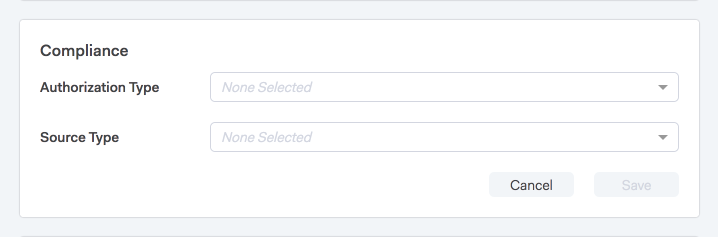
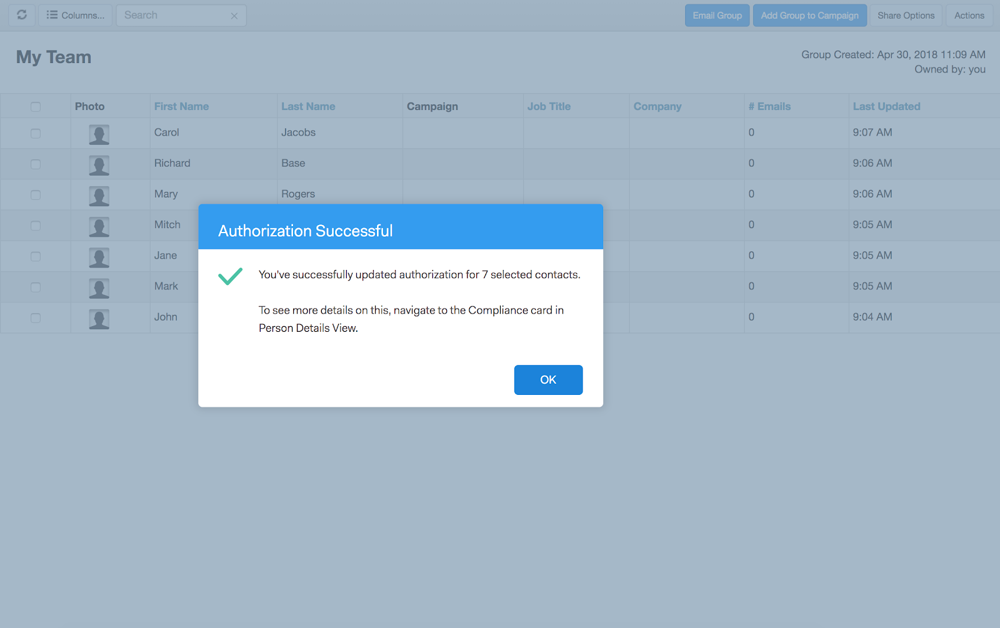

# Conexão de vendas e conformidade com o GDPR {#sales-connect-and-gdpr-compliance}

O Regulamento Geral sobre a Proteção de Dados (GDPR) é uma legislação da União Europeia que entrou em vigor em 25 de maio de 2018.

## Visão geral {#overview}

O seu objetivo é reforçar os direitos dos titulares de dados na União Europeia (UE) e no Espaço Econômico Europeu (EEE) no que diz respeito à forma como os seus dados pessoais são utilizados e protegidos. &quot;Dados pessoais&quot; refere-se a qualquer informação que diga respeito a uma pessoa singular identificada ou identificável.

O RGPD está estruturado em torno de seis princípios fundamentais (pormenorizados no artigo 5. º da legislação):

1. Transparência na forma como os dados serão utilizados e para que serão utilizados.
1. Garantir que os dados recolhidos sejam utilizados apenas para os fins explicitamente especificados no momento da recolha.
1. Limitar a coleta de dados ao necessário para atender à finalidade para a qual foram coletados.
1. Garantir a precisão dos dados.
1. Armazenar os dados somente pelo tempo necessário dentro da finalidade pretendida.
1. Prevenção contra o uso não autorizado ou a perda acidental de dados por meio da implantação de medidas de segurança apropriadas.

Além disso, há um novo requisito de responsabilidade para poder demonstrar como a conformidade está sendo gerenciada e controlada. Isso significa manter registros de como e por que os dados pessoais foram coletados, bem como a documentação dos processos implementados para protegê-los.

## A Quem Se Aplica? {#to-whom-does-it-apply}

O GDPR aplica-se a qualquer organização dentro ou fora da UE que comercialize bens ou serviços para titulares de dados na UE e no EEE e/ou que acompanhe os seus comportamentos. Se você faz negócios com titulares de dados na Europa que envolvem o processamento de dados pessoais, esta legislação se aplica a você. As penalidades por não conformidade são significativas, com multas elevadas para quem viola o regulamento; a multa máxima por uma única violação é de 20 milhões de euros ou 4% do volume de negócios mundial anual, o que for maior.

## Implicações para o marketing {#implications-for-marketing}

Os profissionais de marketing têm como objetivo criar experiências de clientes que se sentem pessoais e humanas, fundadas em confiança e fornecidas com cuidado. Embora o GDPR não use esses termos, as metas são as mesmas: respeitar os direitos dos clientes e ganhar a confiança deles. Para criar e manter essa confiança, os profissionais de marketing devem estar sintonizados com o como, quando e por que seus clientes desejam se envolver. É essencial que as preferências do cliente sejam respeitadas, não apenas como um requisito legal, mas como a base das práticas de envolvimento voltadas para o cliente.

A maneira como os profissionais de marketing abordam essas expectativas mais altas em relação à coleta, ao uso e à segurança dos dados pessoais usados regularmente no curso de seu trabalho é fundamental, e o Marketo pode ajudar a atender a essas expectativas.

Há dois aspectos principais do GDPR em que os profissionais de marketing precisam analisar práticas passadas, atuais e futuras. O primeiro é o consentimento do indivíduo para processar seus dados pessoais, e o segundo é a responsabilidade, ou seja, poder demonstrar como os princípios do GDPR estão sendo seguidos.

Fornecemos informações abrangentes sobre consentimento e responsabilidade na plataforma da Marketo em nosso e-book, [GDPR e O profissional de marketing](https://www.marketo.com/ebooks/the-gdpr-and-the-marketer/). Neste artigo, no entanto, vamos nos concentrar especificamente nos novos recursos no Marketo Sales Connect que ajudarão sua organização a seguir as regras do GDPR.

## Conformidade com o GDPR no Marketo Sales Connect {#gdpr-compliance-in-marketo-sales-connect}

O Marketo Sales Connect é um aplicativo eficiente — parte da Plataforma de engajamento da Marketo — que fornece um fluxo de trabalho e uma visualização únicos para vendas e marketing a fim de impulsionar, coletivamente, um pipeline mais rápido por meio do engajamento colaborativo. A nova funcionalidade no Marketo Sales Connect foi criada especificamente para fins de conformidade com o GDPR. Descreveremos todas as três funções e explicaremos como elas, quando usadas corretamente, ajudarão nos esforços de conformidade do GDPR da sua organização.

## Cartão de conformidade {#compliance-card}

O Marketo Sales Connect inclui um Cartão de Conformidade na Exibição de Detalhes da Pessoa para fornecer informações-chave sobre o Tipo de Autorização de um contato, bem como seu Tipo de Source. Isso permite que os usuários adicionem e rastreiem facilmente informações essenciais à privacidade dos dados e os ajuda a tomar decisões mais informadas sobre a estratégia de campanha/alcance.

Tipo de Autorização de Contato

No Cartão de conformidade, os usuários podem rastrear a base legal para processar os dados pessoais de um contato por meio do menu suspenso Autorização. Entender o tipo de autorização de um contato ajuda os usuários do Marketo Sales Connect a tomar decisões mais conscientes em relação às práticas de alcance, garantindo que cada campanha ou envolvimento seja legal e apropriado.

Os usuários têm várias opções para escolher, incluindo:

* Consentimento
* Interesse legítimo
* Cumprimento de um contrato
* Conformidade com obrigação legal
* Proteção de interesses vitais
* Interesse público/Autoridade oficial
* Outro

Tipo de Source de Contato

No novo Cartão de conformidade, os usuários podem rastrear a origem de um contato. O Tipo de Source define de onde vieram as informações de um contato quando carregadas inicialmente no Marketo Sales Connect. Entender o tipo de origem de um contato também ajuda nas decisões relacionadas às práticas de alcance, bem como determinar quais outros sistemas ou locais os dados pessoais são armazenados, garantindo que cada envolvimento esteja em conformidade com a legislação do GDPR.

Novamente, os usuários têm várias opções suspensas para escolher, incluindo:

* Sincronização com CRM
* Importar
* Upload manual
* Extensão do Chrome
* Outro

Editar o cartão de conformidade

Quando a Exibição de Detalhes da Pessoa estiver aberta, clique em **Editar** no Cartão de Conformidade.

Você verá dois menus suspensos: Tipo de autorização e Tipo de Source.

Se você escolher &quot;Consentimento&quot; como o Tipo de autorização, dois campos obrigatórios: &quot;Data de consentimento&quot; e &quot;Finalidade do processamento&quot; serão exibidos. Esses dois campos não se aplicam a outras opções.

Se &quot;Outro&quot; for escolhido como Tipo de autorização ou Tipo de Source, você poderá inserir texto para descrever o Tipo de Source.

Ações em massa** O Marketo Sales Connect também permite a atualização dos tipos de Autorização e Source de um contato em massa, economizando um tempo valioso no processo de conformidade.

Quando você seleciona um ou mais contatos na página Pessoas, os botões Autorização e Source são exibidos no contêiner superior. Usando esses botões, você pode definir a Autorização ou Source de vários contatos simultaneamente.

Ao clicar no modal Autorização, um pop-up com opções suspensas que correspondem às do Cartão de conformidade é exibido.

Depois que o Tipo de autorização for atualizado, você receberá uma janela pop-up de confirmação e poderá ver os detalhes atualizados no Cartão de conformidade na Exibição de detalhes da pessoa.

Da mesma forma, o Tipo de Source pode ser atualizado em massa também clicando no modal do Source.

Depois de selecionar o Tipo de Source correto para os contatos selecionados, uma janela de confirmação será exibida para confirmar a atualização bem-sucedida.

## Exportando Dados De Contato Do Marketo Sales Connect {#exporting-contact-data-from-marketo-sales-connect}

Você pode exportar informações de contato da Exibição de Detalhes da Pessoa. A exportação baixará um arquivo .CSV com as seguintes colunas:

<table> 
 <colgroup> 
  <col> 
  <col> 
  <col> 
 </colgroup> 
 <tbody> 
  <tr> 
   <td>Nome</td> 
   <td>Site</td> 
   <td>Facebook</td> 
  </tr> 
  <tr> 
   <td>Sobrenome</td> 
   <td>Outro</td> 
   <td>Twitter</td> 
  </tr> 
  <tr> 
   <td>Empresa</td> 
   <td>Atualizado em</td> 
   <td>LinkedIn</td> 
  </tr> 
  <tr> 
   <td>Título</td> 
   <td>Criado em</td> 
   <td>Exportado às</td> 
  </tr> 
  <tr> 
   <td>ID do e-mail</td> 
   <td>ID do Salesforce</td> 
   <td> </td> 
  </tr> 
  <tr> 
   <td>Número de telefone</td> 
   <td>ID de pessoa</td> 
   <td> </td> 
  </tr> 
 </tbody> 
</table>

>[!NOTE]
>
>Isso só pode ser feito em um contato por vez. No momento, não há nenhuma funcionalidade que permita exportações em massa de contatos.

Para exportar informações de contato, clique nos três pontos verticais no Cabeçalho da Exibição de Detalhes da Pessoa e selecione **Exportar**. O arquivo .CSV será baixado automaticamente.

>[!NOTE]
>
>O GDPR também requer a capacidade de excluir contatos da interface do usuário, mas o Marketo Sales Connect já possui essa funcionalidade.

## Cancelamentos de inscrição {#unsubscribes}

Uma área do GDPR comumente mal compreendida envolve contatos que cancelam a inscrição no banco de dados da organização. Para seguir as novas regras de proteção de dados daqueles que optam por cancelar a inscrição, a seguinte funcionalidade foi incluída no Marketo Sales Connect:

**Links para Cancelar Inscrição:** Links para cancelar inscrição serão anexados automaticamente a todos os emails enviados do aplicativo Web do Sales Connect para garantir que os contatos tenham uma maneira acessível de recusar.\
**Cancelar assinatura da sincronização:** os usuários podem sincronizar cancelamentos de assinatura de e para seu CRM (Salesforce) para garantir que os cancelamentos estejam atualizados.\
**Histórico de cancelamento de inscrição:** Os usuários podem ver recusas e recusas históricas na exibição de Detalhes da pessoa.\
**Remoção da inscrição cancelada:** para se inscrever novamente, o usuário deve ter privilégios de administrador e demonstrar que o contato deu novo consentimento para contatá-lo.

## Atualizações futuras {#future-updates}

Como uma defensora entusiasmada da potência e da centralização do cliente na economia do engajamento, a Marketo entende a importância de colocar a privacidade e a proteção de dados nas mãos do titular dos dados. Assim como em outras leis de proteção de dados, a conformidade com o GDPR requer o compromisso da Marketo e de nossos clientes. Este artigo tem como objetivo ajudar você a usar o Marketo de maneira apropriada para oferecer suporte à conformidade com o GDPR da sua organização.

Continuaremos a acompanhar de perto as orientações do GDPR aplicáveis emitidas pelas autoridades reguladoras e pela legislação relacionada. As atualizações serão postadas em nossa Central de Confiabilidade em [trust.marketo.com](https://trust.marketo.com).
