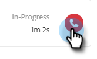

# Resultados da chamada {#call-outcomes}

Permita que suas equipes de vendas selecionem os resultados das chamadas ao fazer chamadas para que sua equipe possa entender o impacto dos esforços de engajamento do cliente.

>[!NOTE]
>
>**Permissões de administrador necessárias.**

## Habilitar resultados de chamadas {#enable-call-outcomes}

1. Clique no ícone de engrenagem e selecione **[!UICONTROL Configurações]**.

   

1. Em [!UICONTROL Configurações de Administração], selecione **[!UICONTROL Discador]**.

   

1. Selecione **[!UICONTROL Habilitar resultados da chamada]**.

   

1. Escolha o requisito de resultado da chamada desejado.

   

## Criar resultados de chamada {#create-call-outcomes}

>[!NOTE]
>
>Você pode criar um máximo de 15 Call Outcomes.

1. Clique no ícone de engrenagem e selecione **[!UICONTROL Configurações]**.

   

1. Em [!UICONTROL Configurações de Administração], selecione **[!UICONTROL Discador]**.

   

1. Clique em **[!UICONTROL Gerenciar resultados da chamada]**.

   

1. Digite o nome do resultado da chamada desejado no campo de texto.

   

1. Clique no menu suspenso [!UICONTROL Respondidas] e escolha o tipo de resultado (neste exemplo, estamos escolhendo Respondidas). Depois clique em **[!UICONTROL Adicionar]**.

   

## Escolher um resultado de chamada {#choose-a-call-outcome}

Após habilitar os resultados da chamada. Os usuários podem selecionar um enquanto fazem uma chamada.

1. Clique no botão de chamada para iniciar o discador.

   

1. Insira as informações de chamada no discador e clique em **[!UICONTROL Chamada]**.

   

1. Selecione o resultado da chamada que melhor descreva a chamada.

   

1. Encerre a chamada.

   

1. Registre a chamada.

   

>[!MORELIKETHIS]
>
>* [Registrar em log os motivos da chamada e seus resultados para a Salesforce](/help/marketo/product-docs/marketo-sales-connect/phone/log-call-reasons-and-call-outcomes-to-salesforce.md)
>* [Motivos da Chamada](/help/marketo/product-docs/marketo-sales-connect/phone/call-reasons.md)
