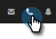

# Motivos da chamada {#call-reasons}

Permita que suas equipes de vendas selecionem os motivos das chamadas ao fazer chamadas para que sua equipe possa entender por que as chamadas estão sendo feitas.

>[!NOTE]
>
>**Permissões de administrador necessárias**

## Ativar Motivos da Chamada {#enable-call-reasons}

1. Clique no ícone de engrenagem e selecione **Configurações**.

   

1. Em Configurações de administração , selecione **Discador**.

   

1. Selecionar **Ativar Motivos da Chamada**.

   

1. Escolha o requisito do motivo da chamada desejado.

   

## Criar Motivo da Chamada {#create-call}

>[!NOTE]
>
>É possível criar um máximo de 15 Razões da chamada.

1. Clique no ícone de engrenagem e selecione **Configurações**.

   

1. Em Configurações de administração , selecione **Discador**.

   

1. Clique em **Gerenciar motivos de chamada**.

   

1. Insira o nome do motivo da chamada desejado no campo de texto e clique em **Adicionar**.

   

## Selecionar um Motivo da Chamada {#select-a-call-reason}

Depois que os motivos da chamada forem ativados. Os usuários podem selecionar uma enquanto fazem uma chamada.

1. Clique no botão de chamada para iniciar o discador.

   

1. Insira as informações da chamada no discador e clique em **Chame**.

   

1. Selecione o motivo da chamada que melhor descreve a chamada.

   

1. Encerre a chamada .

   

1. Registre a chamada .

   

>[!MORELIKETHIS]
>
>* [Motivos de chamada de registro e resultados de chamada para o Salesforce](/help/marketo/product-docs/marketo-sales-connect/phone/log-call-reasons-and-call-outcomes-to-salesforce.md)
>* [Resultados da chamada](/help/marketo/product-docs/marketo-sales-connect/phone/call-outcomes.md)

