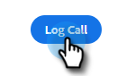

# Motivos da chamada {#call-reasons}

Permita que suas equipes de vendas selecionem os motivos das chamadas ao fazer chamadas para que sua equipe possa entender por que as chamadas estão sendo feitas.

>[!NOTE]
>
>**Permissões de administrador necessárias**

## Habilitar Motivos de Chamada {#enable-call-reasons}

1. Clique no ícone de engrenagem e selecione **[!UICONTROL Configurações]**.

   

1. Em [!UICONTROL Configurações de Administração], selecione **[!UICONTROL Discador]**.

   

1. Selecione **[!UICONTROL Habilitar motivos da chamada]**.

   

1. Escolha o requisito de motivo de chamada desejado.

   

## Criar motivo da chamada {#create-call}

>[!NOTE]
>
>Você pode criar no máximo 15 Motivos de chamada.

1. Clique no ícone de engrenagem e selecione **[!UICONTROL Configurações]**.

   

1. Em [!UICONTROL Configurações de Administração], selecione **[!UICONTROL Discador]**.

   

1. Clique em **[!UICONTROL Gerenciar motivos da chamada]**.

   

1. Digite o nome do motivo da chamada desejado no campo de texto e clique em **[!UICONTROL Adicionar]**.

   

## Selecionar um motivo de chamada {#select-a-call-reason}

Após habilitar os motivos da chamada. Os usuários podem selecionar um enquanto fazem uma chamada.

1. Clique no botão de chamada para iniciar o discador.

   

1. Insira as informações de chamada no discador e clique em **[!UICONTROL Chamada]**.

   

1. Selecione o motivo da chamada que melhor descreve a chamada.

   

1. Encerre a chamada.

   

1. Registre a chamada.

   

>[!MORELIKETHIS]
>
>* [Registrar em log os motivos da chamada e seus resultados para a Salesforce](/help/marketo/product-docs/marketo-sales-connect/phone/log-call-reasons-and-call-outcomes-to-salesforce.md)
>* [Resultados da Chamada](/help/marketo/product-docs/marketo-sales-connect/phone/call-outcomes.md)
