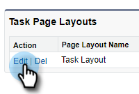
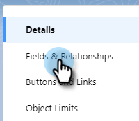

# Registrar em log os motivos da chamada e seus resultados para [!DNL Salesforce] {#log-call-reasons-and-call-outcomes-to-salesforce}

Se você quiser registrar os resultados da chamada e os motivos da chamada para [!DNL Salesforce] para fins de relatório ou visibilidade, poderá criar um campo de atividade personalizado para cada um. Cada campo deve usar um Nome de API específico (conhecido como &quot;Nome do Campo&quot; em [!DNL Salesforce]).

* Nome do campo Resultados da chamada: mktosales_call_result
* Nome do Campo Motivos da Chamada: mktosales_call_reason

Para utilizar esses campos, primeiro será necessário criar o campo como um campo de atividade personalizado. Para torná-la visível aos usuários, será necessário adicioná-la ao layout da página do objeto da tarefa.

## [!DNL Salesforce] Classic {#salesforce-classic}

### Criar Campo de Atividade Personalizado no [!DNL Salesforce] Classic  {#create-custom-activity-field-in-salesforce-classic}

1. Em [!DNL Salesforce], clique em **[!UICONTROL Instalação]**.

   

1. Digite &quot;Atividades&quot; na caixa Localização rápida.

   

1. Clique em **[!UICONTROL Campos Personalizados de Atividade]**.

   

1. Clique em **[!UICONTROL Novo]**.

   

1. Selecione o tipo de dados &quot;[!UICONTROL Texto]&quot; e clique em **[!UICONTROL Avançar]**.

   

1. Dê ao campo personalizado o nome do campo conforme definido acima. O comprimento do campo tem um limite de 255 caracteres. Rótulo de campo será o campo visível para sua equipe de vendas e pode ser personalizado para atender às necessidades de sua equipe.

   

1. O restante das configurações é opcional. Depois de concluir a configuração, clique em **[!UICONTROL Avançar]**.

   

1. Selecione as configurações de segurança em nível de campo desejadas para este campo e clique em **[!UICONTROL Avançar]** (a imagem abaixo é apenas um exemplo).

   

   >[!NOTE]
   >
   >Verifique se o campo personalizado está visível para o perfil que seus usuários do [!DNL Sales Connect] usam, juntamente com qualquer outro lugar em que você deseje que ele fique visível.

1. Selecione os layouts de página aos quais você deseja adicionar o campo e clique em **[!UICONTROL Salvar]** (opcionalmente, você pode clicar em **[!UICONTROL Salvar e novo]** e repetir o processo para o campo Motivo da chamada).

   

### Adicionar Campo De Atividade Personalizado Ao Layout Da Página De Tarefas No [!DNL Salesforce] Classic {#add-custom-activity-field-to-task-page-layout-in-salesforce-classic}

>[!NOTE]
>
>Você só precisará seguir essas etapas se não tiver selecionado o layout de página desejado na Etapa 9 acima.

1. Em [!DNL Salesforce], clique em **[!UICONTROL Instalação]**.

   

1. Digite &quot;Tarefa&quot; na caixa Localização Rápida.

   

1. Clique em **[!UICONTROL Layouts de Página de Tarefa]**.

   

1. Clique em **[!UICONTROL Editar]** ao lado do layout da página de tarefas à qual você deseja adicionar este campo.

   

1. Arraste e solte o campo até a seção desejada do layout da página Tarefa.

   

1. Clique em **[!UICONTROL Salvar]**.

   

## [!DNL Salesforce] Relâmpago {#salesforce-lightning}

### Criar campo de atividade personalizado no [!DNL Salesforce] Lightning {#create-custom-activity-field-in-salesforce-lightning}

1. Em [!DNL Salesforce], clique no ícone de engrenagem na parte superior direita e selecione **[!UICONTROL Instalação]**.

   

1. Clique em **[!UICONTROL Gerenciador de objetos]**.

   

1. Digite &quot;[!UICONTROL Atividade]&quot; na caixa Localização Rápida.

   

1. Clique no rótulo **[!UICONTROL Atividade]**.

   

1. Clique em **[!UICONTROL Campos e Relações]**.

   

1. Clique em **[!UICONTROL Novo]**.

   

### Adicionar Campo de Atividade Personalizado ao Layout da Página de Tarefa no [!DNL Salesforce] Lightning {#add-custom-activity-field-to-task-page-layout-in-salesforce-lightning}

1. Em [!DNL Salesforce], clique no ícone de engrenagem na parte superior direita e selecione **[!UICONTROL Instalação]**.

   

1. Clique em **[!UICONTROL Gerenciador de objetos]**.

   

1. Digite &quot;[!UICONTROL Tarefa]&quot; na caixa Localização Rápida.

   

1. Clique no rótulo **[!UICONTROL Tarefa]**.

   

1. Clique em **[!UICONTROL Layouts de página]**.

   

1. Clique no layout da página de tarefas à qual deseja adicionar este campo.

   

1. Arraste e solte o campo até a seção desejada do layout da página Tarefa.

   

1. Clique em **[!UICONTROL Salvar]**.

   

>[!MORELIKETHIS]
>
>[Instalar Campos de Evento do Sales Connect no Histórico de Atividades](/help/marketo/product-docs/marketo-sales-connect/crm/salesforce-customization/install-sales-connect-event-fields-on-activity-history.md)
