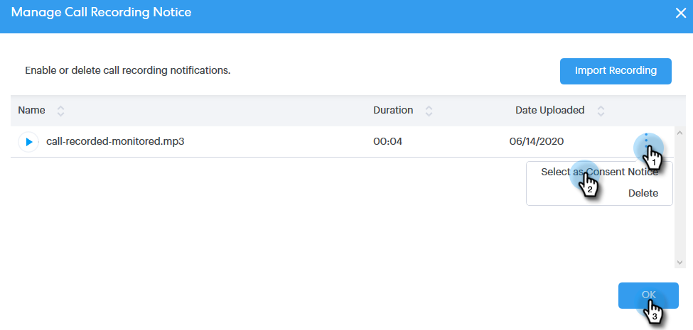

# Configurações de consentimento de duas partes {#two-party-consent-settings}

Para garantir a conformidade com as leis de consentimento de duas partes dos EUA ao gravar chamadas, como administrador, você pode ativar uma mensagem pré-gravada de sua escolha para reproduzir no início das chamadas quando elas estiverem sendo gravadas.

>[!NOTE]
>
>**Pré-requisitos**
>
>Antes de seguir as etapas abaixo, você deve primeiro [ativar a gravação de chamadas.](http://docs.marketo.com/x/dAC1Ag)

1. Clique no ícone Configurações e selecione **Configurações**.

   

1. Em Configurações administrativas, clique em **Geral**.

   

1. Role para baixo até Configurações do telefone do Connect de vendas e clique em **Gerenciar aviso** de gravação.

   

1. Clique em **Importar gravação**.

   

   >[!NOTE]
   >
   >Somente os arquivos Wav e MP3 são suportados. Não é possível carregar um arquivo por mais de 30 segundos.

1. Selecione o arquivo de áudio desejado no disco rígido.

   

1. Quando o upload estiver concluído, selecione o dota (três pontos) no gerenciador de arquivos e clique em **Selecionar como aviso** de consentimento. Clique em **OK** quando concluído.

   

1. Clique na alternância para ativar a mensagem selecionada para ser reproduzida no início das chamadas gravadas.

   

