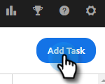
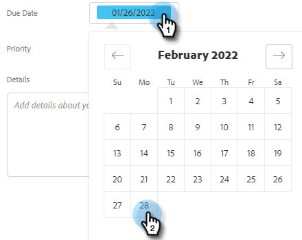

# Criar e Atribuir Tarefas de Lembrete {#create-and-assign-reminder-tasks}

As tarefas de lembrete são uma ótima maneira de manter o controle sobre o envolvimento do cliente e do cliente potencial. Para criar uma tarefa, siga estas etapas.

1. Clique em **[!UICONTROL Centro de comando]**.

   

1. Tarefas são abertas por padrão. Clique em **[!UICONTROL Adicionar tarefa]**.

   

1. Selecione o tipo de tarefa de [!UICONTROL Email], [!UICONTROL Chamada], [!UICONTROL InMail] ou Tarefa [!UICONTROL Personalizada].

   

1. Nomeie a tarefa.

   

1. Escolha manter a tarefa atribuída a você mesmo ou selecionar outro usuário para atribuir sua tarefa.

   

1. Adicione a pessoa com quem você está acompanhando, com esta tarefa de lembrete.

   

1. Selecione a data de vencimento da tarefa.

   

1. Selecione a prioridade da tarefa.

   

1. Adicione todos os detalhes sobre a tarefa que gostaria de ter à sua disposição ao concluí-la, como anotações de conversas de chamada, um modelo de mensagem do InMail ou até mesmo anotações sobre a pessoa. Clique em **[!UICONTROL Criar]** quando terminar.

   
