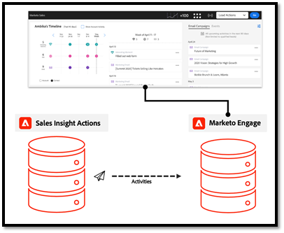

# Perguntas frequentes sobre a Sincronização de Dados de Ações {#actions-data-sync-faq}

A sincronização de campo de unificação de dados para [!DNL Sales Insight Actions] permite que o sistema extraia informações de pessoas do banco de dados Marketo Engage para o banco de dados [!DNL Sales Insight Actions].

Isso fornece dados atualizados de pessoas no aplicativo Web [!DNL Sales Insight Actions] e permite que o sistema colete IDs exclusivas para registros de pessoas correspondentes no Marketo e registros de cliente em potencial/contato/conta/oportunidade em [!DNL Salesforce], para que os registros possam ser referenciados corretamente para dados de log.

Esta sincronização pode ser habilitada na guia Configuração [!DNL Sales Insight Actions], na seção Administração do Marketo Engage. Para obter mais informações, confira [Iniciar Sincronização de Dados](/help/marketo/product-docs/marketo-sales-insight/actions/getting-started/sales-insight-actions-admin-setup-guide.md#initiate-data-sync).

O diagrama acima mostra como os dados de atividades e tarefas das pessoas podem ser sincronizados entre sistemas. Algumas observações:

* Os registros de pessoas são sincronizados com [!DNL Sales Insight Actions] do Marketo Engage, tornando o Marketo Engage a fonte da verdade para [!DNL Sales Insight Actions] dados de pessoas
* O Marketo Engage e [!DNL Sales Insight Actions] [têm um mecanismo](/help/marketo/product-docs/marketo-sales-insight/actions/email/unsubscribes/syncing-unsubscribes-with-salesforce.md) para coletar e sincronizar o status de cancelamento de inscrição para [!DNL Salesforce]
* O status de cancelamento de inscrição não é sincronizado das Ações de Vendas para o Marketo Engage, mas o [!DNL Sales Insight Actions] pode ser configurado para verificar o status de cancelamento de inscrição de pessoas no Marketo antes de permitir que os vendedores enviem um email com [Verificação de cancelamento de inscrição do Marketo](/help/marketo/product-docs/marketo-sales-insight/actions/email/unsubscribes/marketo-unsubscribe-check.md).

Abaixo estão algumas perguntas frequentes relacionadas ao funcionamento da sincronização de unificação de dados.

## Quais clientes em potencial/contatos estão sincronizados com [!DNL Sales Insight Actions]? {#what-lead-contacts-are-synced}

Clientes potenciais e contatos que tiverem um proprietário de vendas atribuído a eles serão sincronizados em Ações de Vendas.

Você pode ver se um cliente potencial/contato tem um proprietário de vendas em [!DNL Salesforce] observando o campo proprietário padrão existente.

O proprietário de vendas não precisa ser o usuário de sincronização do Marketo ou qualquer [!DNL Salesforce] ou usuário de vendas específico. Tudo o que precisamos é que haja um usuário listado no campo de proprietário do cliente potencial e proprietário do contato listado em [!DNL Salesforce], para que possamos identificá-lo como um cliente potencial de vendas e sincronizá-lo em [!DNL Sales Insight Actions]. Quaisquer atualizações nos campos que sincronizamos também serão detectadas e atualizadas em [!DNL Sales Insight Actions].

## De onde os dados da atividade exibidos no Sales Insight Smart Grid são obtidos? {#where-does-the-activity-data-get-sourced-from}

Os dados de atividade, como email, chamada, momento interessante e Web, são todos provenientes do banco de dados do Marketo Engage. O Sales Insight Smart Grid faz uma solicitação à instância do Marketo Engage para recuperar isso sempre que um usuário de vendas carregar o painel Sales Insight.

Para garantir que todos os dados da atividade possam ser obtidos do Marketo Engage, o [!DNL Sales Insight Actions] sincroniza todos os dados da atividade com o Marketo Engage.

## Quais campos relacionados à sincronização de registros de pessoas do Marketo Engage para o [!DNL Sales Insight Actions]? {#what-fields-sync}

Há 11 campos que são sincronizados do Marketo Engage para o [!DNL Sales Insight Actions]:

* Nome
* Sobrenome
* ID de contato de [!DNL Salesforce]
* ID do cliente em potencial [!DNL Salesforce]
* ID da conta de [!DNL Salesforce]
* [!DNL Salesforce] ID da oportunidade
* ID do Marketo
* Empresa
* Título
* Email
* Número de telefone
* URL [!DNL Linkedin]
* Origem

## Os campos sincronizados entre o Marketo Engage e o [!DNL Sales Insight Actions] podem ser configurados? {#are-the-fields-that-sync-configurable}

A configuração da sincronização de campos do Marketo Engage com o [!DNL Sales Insight Actions] não está disponível, assim como a capacidade de mapear campos. A sincronização do Marketo mapeia automaticamente campos padrão do Marketo para campos padrão na instância de Ação de vendas.

## Por que [!DNL Sales Insight Actions] tem seu próprio banco de dados? {#why-does-actions-have-its-own-database}

O [!DNL Sales Insight Actions] tem seu próprio aplicativo web com um banco de dados dedicado de pessoas e atividades para fornecer um espaço de trabalho otimizado que é criado e projetado para equipes de vendas. Isso permite que gerentes e vendedores tenham um espaço para desenvolver e gerenciar sua estratégia de engajamento   sem conceder acesso ou privilégios ao espaço de trabalho principal do Marketo Engage, que é otimizado para especialistas em operações de marketing.

## Como as duplicatas são tratadas? {#how-are-duplicates-handled}

Seu banco de dados de Ações de vendas será uma cópia das pessoas qualificadas (clientes potenciais/contatos com um proprietário de vendas) existentes no banco de dados do Marketo Engage. Isso significa que, se houver dois registros com o mesmo endereço de email criado no Marketo, haverá um registro duplicado criado nas Ações de vendas.

## Quanto tempo leva para a sincronização inicial ser concluída? {#how-long-initial-sync}

O processo inicial para sincronizar todos os seus dados de venda de clientes potenciais em uma nova instância do [!DNL Sales Insight Actions] normalmente processará pessoas em cerca de 1.000 a cada 1-2 minutos. Isso é apenas uma estimativa e pode variar.

Quando a sincronização inicial ocorrer e todos os seus leads de vendas tiverem sido preenchidos na instância do aplicativo Web [!DNL Sales Insight Actions], haverá uma sincronização incremental que será executada sempre que houver uma atualização em um dos campos compatíveis que estão sincronizados.

## Os usuários [!DNL Sales Insight Actions] podem editar dados de pessoas no aplicativo Web Ações? {#can-actions-users-edit-people-data}

Não, a capacidade de criar e editar registros de pessoas em Ações não está disponível para usuários e administradores do aplicativo Web Ações. Criar e editar pessoas deve ser feito no [!DNL Salesforce] ou no Marketo Engage. O [!DNL Sales Insight Actions] usa o Marketo como sua fonte de dados verdadeiros para os dados de pessoas, sincronizando continuamente novos dados; portanto, se uma pessoa for atualizada ou criada no Marketo a partir de um fluxo de trabalho no Marketo ou sincronizada a partir do [!DNL Salesforce], essas atualizações serão passadas para o banco de dados do aplicativo Web [!DNL Sales Insight Actions].

## As atividades de vendas registram no Marketo? {#do-sales-activities-log-to-marketo}

Sim, as atividades do contrato de vendas serão registradas no Marketo como atividades nativas. Essas atividades também incluem filtros nativos que podem ser usados com restrições para direcionar leads com base nos atributos da atividade de vendas.

Veja abaixo uma lista das atividades que fazem logon no Marketo:

* Enviar e-mail de vendas
* Abrir email de vendas
* Clicar em email de vendas
* Respondeu ao e-mail de vendas
* E-mail de vendas foi devolvido
* Chamada de vendas recebida
* Adicionar a campanha de vendas
* Removido da campanha de vendas

## As atividades de vendas registram em [!DNL Salesforce]? {#do-sales-activities-log-to-salesforce}

Sim, as atividades de envolvimento de vendas registrarão em [!DNL Salesforce] como tarefas nativas. Essas tarefas podem ser usadas em relatórios do [!DNL Salesforce] para alimentar painéis de equipe que rastreiam as atividades de vendas.

[!DNL Sales Insight Actions] permite que os administradores configurem quais atividades de vendas estão registradas em [!DNL Salesforce]. Essas atividades incluem emails, chamadas e tarefas de lembrete de abertura.

O diagrama acima mostra quais informações estão registradas em [!DNL Salesforce]. Atividades como emails e chamadas são registradas em [!DNL Salesforce] em uma [sincronização unidirecional](/help/marketo/product-docs/marketo-sales-insight/actions/crm/salesforce-integration/salesforce-sync-settings.md). [Cancelamentos de assinatura](/help/marketo/product-docs/marketo-sales-insight/actions/email/unsubscribes/syncing-unsubscribes-with-salesforce.md) e [Tarefas de Lembrete](/help/marketo/product-docs/marketo-sales-insight/actions/tasks/reminder-task-sync-with-salesforce.md) são mantidos atualizados com uma sincronização bidirecional. Cada uma dessas sincronizações de dados pode ser configurada na interface do aplicativo Web [!DNL Sales Insight Actions].

>[!MORELIKETHIS]
>
>* [Sincronizando Cancelamentos de Assinatura com [!DNL Salesforce]](/help/marketo/product-docs/marketo-sales-insight/actions/email/unsubscribes/syncing-unsubscribes-with-salesforce.md)
>* [Verificação de Cancelamento de Inscrição do Marketo](/help/marketo/product-docs/marketo-sales-insight/actions/email/unsubscribes/marketo-unsubscribe-check.md)
>* [[!DNL Salesforce] Configurações de sincronização](/help/marketo/product-docs/marketo-sales-insight/actions/crm/salesforce-integration/salesforce-sync-settings.md)
>* [Sincronização de Tarefa de Lembrete com [!DNL Salesforce]](/help/marketo/product-docs/marketo-sales-insight/actions/tasks/reminder-task-sync-with-salesforce.md)
>* [Iniciar Sincronização de Dados](/help/marketo/product-docs/marketo-sales-insight/actions/getting-started/sales-insight-actions-admin-setup-guide.md#initiate-data-sync)
