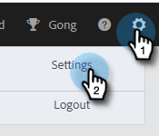

# Domínios bloqueados {#blocked-domains}

Ajude sua equipe de vendas a obter sucesso, evitando que ela envie emails para concorrentes, interceptações de spam conhecidas ou qualquer outro domínio que você não queira contatar.

>[!NOTE]
>
>**Permissões de administrador são necessárias**

1. No aplicativo Web, clique no ícone de engrenagem e selecione **[!UICONTROL Configurações]**.

   

1. Em [!UICONTROL Configurações de Administração], clique em **[!UICONTROL Geral]**.

   

1. Insira o domínio que você deseja bloquear e clique em **[!UICONTROL Bloquear Domínio]**.

   

   >[!NOTE]
   >
   >Os e-mails que fazem parte de um envio de E-mail de grupo que falhar devido ao envio para um domínio de e-mail bloqueado falharão silenciosamente e não aparecerão na pasta de e-mails com falha.
