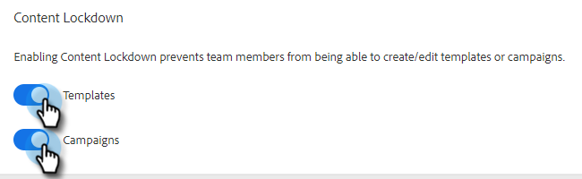

# Bloqueio de conteúdo {#content-lockdown}

Ao ativar o bloqueio de conteúdo, impeça que usuários não administradores editem modelos e/ou campanhas. Os usuários não poderão: compartilhar, clonar, editar ou excluir conteúdo. Eles também não terão a opção de arquivar modelos.

>[!NOTE]
>
>Os usuários ainda poderão editar o conteúdo de um email no momento do envio ou ao iniciar uma campanha.

1. Clique no ícone de engrenagem e selecione **[!UICONTROL Configurações]**.

   

1. Em [!UICONTROL Configurações de Administração], clique em **[!UICONTROL Geral]**.

   

1. Role para baixo até [!UICONTROL Bloqueio de conteúdo]. Ativar qualquer um dos controles deslizantes desativará a capacidade dos membros da equipe de criar/editar modelos e/ou campanhas.

   
