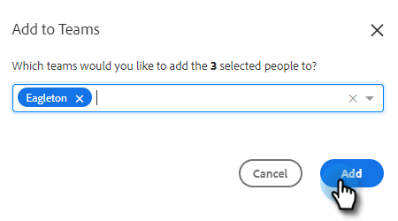

# Criar uma equipe {#creating-a-team}

A criação de uma equipe permite reunir um grupo de usuários com os quais o conteúdo pode ser compartilhado e os relatórios podem ser filtrados.

## Criar uma equipe {#create-a-team}

1. No [aplicativo Web](https://toutapp.com/login), clique no ícone de engrenagem e selecione **[!UICONTROL Configurações]**.

   

1. Em [!UICONTROL Configurações de Administração], selecione **[!UICONTROL Gerenciamento de Equipe]**.

   

1. Ao lado de [!UICONTROL Equipes], clique no ícone **+**.

   

1. Insira um nome de equipe e clique em **[!UICONTROL Criar]**.

   

>[!NOTE]
>
>Agora você pode compartilhar modelos, campanhas e grupos com essa equipe.

## Adicionar Pessoas a uma Equipe {#add-people-to-a-team}

1. Ainda em [!UICONTROL Team Management], selecione **[!UICONTROL Todos os Membros]**.

   

1. Localize os usuários que você deseja adicionar à equipe e marque as caixas de seleção deles.

   

1. Clique em **[!UICONTROL Adicionar às Equipes]**.

   

1. Clique no menu suspenso e selecione a(s) equipe(s) desejada(s).

   

1. Clique em **[!UICONTROL Adicionar]** quando terminar.

   
