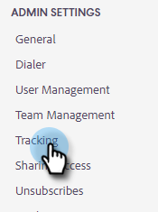

# Como configurar o rastreamento de domínio personalizado {#how-to-set-up-custom-domain-tracking}

O Rastreamento de domínio personalizado permite que sua equipe use o nome da própria empresa em todos os links rastreáveis adicionados aos emails de vendas. Depois de configurar isso, incluiremos na lista de permissões qualquer link que você tiver no seu e-mail para aparecer como go.yourcompany.com, para que, quando alguém passar o mouse sobre um link, ele leia go.yourcompany.com em vez de go.toutapp.com.

Você precisará da assistência da sua equipe de TI para configurar um registro CNAME para o seu domínio que aponte para go.toutapp.com. Esse CNAME será o que aparece em todos os links de rastreamento (por exemplo, go.yourcompany.com).

Depois de confirmar com sua equipe de TI que o CNAME está configurado corretamente, você pode adicioná-lo à página Rastreamento de domínio personalizado em Ações.

>[!NOTE]
>
>Se o CNAME não estiver configurado corretamente e você ativá-lo como seu domínio personalizado em Ações, ele poderá quebrar os links e pixels de rastreamento.

## Habilitar o rastreamento de domínio personalizado {#enable-custom-domain-tracking}

>[!NOTE]
>
>**Privilégios de administrador necessários.**

1. Clique no ícone de engrenagem e selecione **Configurações**.

   

1. Em Configurações do administrador, selecione **Acompanhamento**.

   

1. Na guia Custom Domain Tracking, digite seu CNAME e clique em **Conectar**.

   
