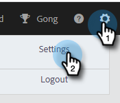
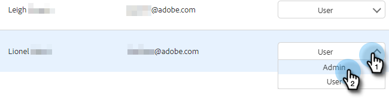

# Convidar usuários e admins {#invite-users-and-admins}

Adicionar usuários ou administradores é rápido e fácil!

## Convidar usuários {#invite-users}

1. Clique no ícone de engrenagem e selecione **[!UICONTROL Configurações]**.

   

1. Em [!UICONTROL Configurações de Administração], selecione **[!UICONTROL Gerenciamento de Usuários]**.

   

1. Clique no botão **[!UICONTROL Ações]** e selecione **[!UICONTROL Convidar Usuários]**.

   

   >[!NOTE]
   >
   >Você também pode selecionar **[!UICONTROL Convidar usuários via CSV]** se todos estiverem listados em uma planilha.

1. Insira os endereços de email das pessoas físicas que você deseja adicionar.

   

1. ETAPA OPCIONAL: adicione os usuários às equipes das quais eles devem fazer parte. Se você ignorar esta parte, todos os novos membros serão adicionados à equipe Todos.

   

   >[!NOTE]
   >
   >[Saiba mais sobre Equipes](/help/marketo/product-docs/marketo-sales-insight/actions/admin/creating-a-team.md).

1. Selecione o espaço de trabalho do Marketo ao qual deseja adicionar o(s) novo(s) usuário(s). Se você tiver apenas um espaço de trabalho, verá &quot;Padrão&quot; como sua opção. Clique em **Convidar**.

   

1. Clique em **[!UICONTROL OK]**.

   

## Transformar um usuário em administrador {#make-a-user-an-admin}

>[!NOTE]
>
>**Permissões de administrador necessárias**

Siga estas etapas para tornar um usuário existente um Administrador.

1. Clique no ícone de engrenagem e selecione **[!UICONTROL Configurações]**.

   

1. Em [!UICONTROL Configurações de Administração], selecione **[!UICONTROL Gerenciamento de Usuários]**.

   

1. Localize o usuário que você quer que seja um Administrador, clique no menu suspenso Função e selecione **[!UICONTROL Administrador]**.

   

Simples assim!
