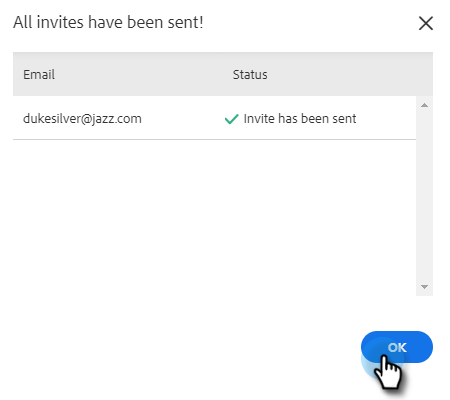

# Convidar usuários e administradores {#invite-users-and-admins}

Adicionar usuários ou administradores é rápido e fácil!

## Convidar usuários {#invite-users}

1. Clique no ícone de engrenagem e selecione **Configurações**.

   

1. Em Configurações de administração, selecione **Gerenciamento de usuários**.

   

1. Clique no botão **Ações** e selecione **Convidar usuários**.

   

   >[!NOTE]
   >
   >Você também pode selecionar **Convidar usuários via CSV** se todos estiverem listados em uma planilha.

1. Insira os endereços de email dos indivíduos que deseja adicionar e clique em **Convidar** (selecionar uma equipe para adicioná-las é opcional).

   

   >[!NOTE]
   >
   >Por padrão, todos os novos membros serão adicionados à equipe Todos.

1. Clique em **OK**.

   

## Tornar um usuário um administrador {#make-a-user-an-admin}

>[!NOTE]
>
>**Permissões de administrador necessárias**

Siga estas etapas para tornar um usuário existente um Administrador.

1. Clique no ícone de engrenagem e selecione **Configurações**.

   

1. Em Configurações de administração, selecione **Gerenciamento de usuários**.

   

1. Encontre o usuário que você deseja fazer um Administrador, clique no menu suspenso Função e selecione **Administrador**.

   

Simples assim!
