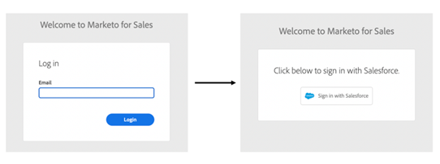

# Configurações de gerenciamento de logon {#login-management-settings}

As configurações do Gerenciamento de logon permitem que os administradores definam as preferências de autenticação para usuários das Ações do Sales Insight em nível global.

>[!NOTE]
>
>Por padrão, a opção [!UICONTROL Somente Salesforce] será selecionada para [!DNL Sales Insight Actions] instâncias. Recomendamos esta configuração para que os usuários possam [fazer logon automático](/help/marketo/product-docs/marketo-sales-insight/actions/admin/auto-login-from-salesforce.md) de [!DNL Salesforce].

## Atualizar Configurações de Gerenciamento de Logon {#update-login-management-settings}

>[!NOTE]
>
>**Permissões de administrador necessárias**

Para atualizar suas preferências de gerenciamento de logon, siga estas etapas.

1. Clique no ícone de engrenagem e selecione **[!UICONTROL Configurações]**.

   

1. Em [!UICONTROL Configurações de Administração], clique em **[!UICONTROL Geral]**.

   

1. Role para baixo até o cartão [!UICONTROL Gerenciamento de logon] e selecione a configuração desejada (neste exemplo, estamos escolhendo Somente Salesforce). Clique em **[!UICONTROL Salvar]** quando terminar.

   

## Perguntas frequentes somente sobre o Salesforce {#salesforce-only-faq}

Somente Salesforce significa que os usuários só podem autenticar para usar [!DNL Sales Insight Actions] com [!DNL Salesforce]. É a seleção padrão para [!DNL Sales Insight Actions] instâncias e é recomendada devido à sua capacidade de permitir que os usuários se autentiquem sem problemas sem precisar gerenciar um nome de usuário e uma senha.

### Como um novo usuário em minha instância ativa sua conta quando &quot;[!UICONTROL Somente Salesforce]&quot; é selecionado? {#activate-when-salesforce-only-is-selected}

Ao clicar no botão **[!UICONTROL Introdução]** no email de convite, os novos usuários serão enviados para uma tela de ativação de conta, onde serão solicitados a conectar sua instância do Salesforce para ativar sua conta do [!DNL Sales Insight Actions].

### Com quais métodos de autenticação meus usuários podem realizar a autenticação quando a opção &quot;[!UICONTROL Somente Salesforce]&quot; está selecionada? {#what-authentication-methods}

Ao navegar para nossa tela de logon, os usuários digitarão primeiro seu endereço de email. Em seguida, eles clicarão no botão [!UICONTROL Logon] do Salesforce One Click, no qual podem se autenticar usando a conta da Salesforce na qual estão conectados.

>[!NOTE]
>
>Isso se refere apenas aos usuários que navegam diretamente para a tela de logon. Os usuários que estão acessando Ações de [!DNL Salesforce] serão conectados com [Logon automático](/help/marketo/product-docs/marketo-sales-insight/actions/admin/auto-login-from-salesforce.md).

### Como a autenticação de usuário é tratada para Ações quando um usuário acessa um recurso Ações do Salesforce e &quot;Somente Salesforce&quot; é selecionado? {#how-is-user-authentication-handled}

Quando um usuário clica em uma das ações (Chamada, Email, Campanha, Tarefas, Lista de Campanhas etc.), usamos a autenticação da SFDC para fazer logon automaticamente na conta [!DNL Sales Insight Actions]. Chamamos esta autenticação de [Logon automático](/help/marketo/product-docs/marketo-sales-insight/actions/admin/auto-login-from-salesforce.md).

## Perguntas frequentes sobre todos os métodos de logon {#all-login-methods-faq}

### Como um novo usuário na minha instância ativa a conta dele quando &quot;Todos os métodos de logon&quot; é selecionado? {#activate-when-all-login-methods-is-selected}

Quando um novo usuário é convidado para uma instância, ele recebe um email de ativação de conta. Eles clicarão no botão que diz &quot;Introdução&quot;, que os levará a uma página que solicita que criem e confirmem uma senha. Depois de criado, a conta dele será ativada e eles serão transferidos para o fluxo de trabalho de integração.

### Com o que os usuários da minha instância podem fazer logon quando &quot;[!UICONTROL Todos os Métodos de Logon]&quot; é selecionado? {#what-are-users-allowed-to-log-in-with-all-login}

Ao usar nossa página de logon, os usuários inserirão primeiro seu endereço de email. Em seguida, eles serão enviados para uma página que fornece todas as opções de logon (nome de usuário/senha, SFDC, Gmail, SSO) para autenticação.
