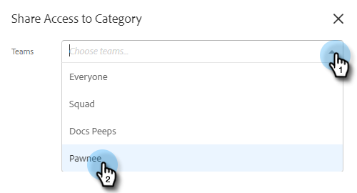
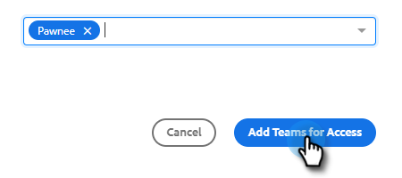

# Configurações de compartilhamento {#sharing-settings}

Gerencie melhor seus modelos restringindo o que os usuários podem compartilhar e com quais categorias.

Quando sua conta de Ações do Sales Insight é criada pela primeira vez, as Configurações de compartilhamento são ativadas. Isso dá aos administradores da sua conta a oportunidade de criar e organizar suas categorias de modelo antes de abrir as comportas e permitir que os usuários compartilhem conteúdo nas categorias da sua equipe.

Quando as Configurações de compartilhamento estiverem ativadas, somente administradores poderão compartilhar em categorias, a menos que os privilégios de compartilhamento sejam fornecidos a uma equipe ou a todos. Com as Configurações de compartilhamento desativadas, não há restrições e todos os usuários podem compartilhar em qualquer categoria de modelo.

## Definir Suas Configurações De Compartilhamento {#configure-your-sharing-settings}

1. No [aplicativo Web](https://toutapp.com/login), clique no ícone de engrenagem e selecione **[!UICONTROL Configurações]**.

   

1. Em [!UICONTROL Configurações de Administração], selecione **[!UICONTROL Acesso de Compartilhamento]**.

   

1. Verifique se as **[!UICONTROL Configurações de Compartilhamento]** estão habilitadas. Isso significa que, por padrão, somente Administradores poderão compartilhar modelos nas categorias do modelo.

   

1. Selecione a categoria do template que deseja configurar.

   

1. Clique em **[!UICONTROL Adicionar equipes para acessar]**.

   

1. Selecione as equipes que deseja adicionar.

   

   >[!NOTE]
   >
   >Se você não vir nenhuma equipe, precisará ir para o Gerenciamento de Equipe e criar uma equipe de usuários.

1. Clique em **[!UICONTROL Adicionar Equipes para Acesso]** para salvar.

   

1. Agora que sua equipe foi adicionada, você pode optar por permitir que somente administradores de equipe compartilhem ou todos os usuários dessa equipe. Neste exemplo, estamos dando acesso a todos os usuários na equipe de SDR que compartilha.

   
