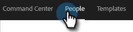
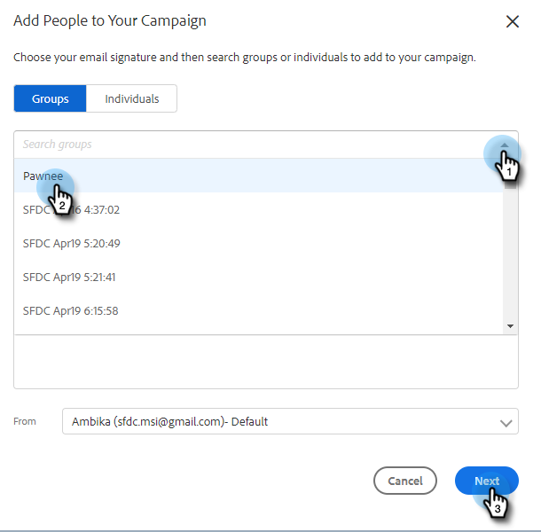

# Adicionar à campanha de marketing {#add-to-marketing-campaign}

>[!PREREQUISITES]
>
>[Tornar uma Campanha Visível para Usuários de Vendas](/help/marketo/product-docs/marketo-sales-insight/actions/marketo/make-a-campaign-visible-to-sales-connect-users.md)

## Adicionar indivíduos a uma campanha {#add-individuals-to-a-campaign}

>[!NOTE]
>
>Para adicionar uma pessoa a uma campanha do Marketo a partir do Sales Connect, o Sales Connect deve ter a ID de cliente potencial do Marketo da pessoa.

1. Clique na guia **Pessoas**.

   

1. Localize os contatos que deseja adicionar.

   

1. Clique na caixa de seleção para selecionar seu(s) contato(s) e clique em **Adicionar seleção à campanha**.

   

1. PASSAR AQUI

   

1. Como você está adicionando a uma campanha de marketing, pule a seleção de um endereço &quot;de&quot;. No entanto, você pode optar por adicionar mais contatos. Se desejar, clique em Indivíduos e digite-os. Clique em **Avançar** quando terminar.

   

1. Clique em **Campanha de marketing**.

PICC

1. Clique na lista suspensa Espaços de trabalho e escolha o espaço de trabalho que contém a campanha à qual você deseja adicionar o grupo.

PICC

>[!NOTE]
>
>Se você não vir o espaço de trabalho desejado, verifique se o Administrador o provisiona por meio da página Acesso à equipe da Marketo.

1. Selecione a campanha desejada e clique em **Avançar**.

PICC

1. Você verá os contatos que se qualificam. Clique em **Iniciar** para adicioná-los.

PICC

## Adicionar um grupo a uma campanha {#add-a-group-to-a-campaign}

1. Clique na guia **Pessoas**.

PICC

1. Em Meus grupos, selecione o grupo que deseja adicionar a uma campanha.

PICC

1. Clique em **Adicionar grupo à campanha**.

PICC

1. Como você está adicionando a uma campanha de marketing, pule a seleção de um endereço &quot;de&quot;. No entanto, você pode optar por adicionar mais contatos. Se desejar, clique em Indivíduos e digite-os. Clique em **Avançar** quando terminar.

PICC

1. Selecione **Campanha de marketing**.

PICC

>[!NOTE]
>
>Para adicionar uma pessoa a uma campanha do Marketo a partir do Sales Connect, o Sales Connect deve ter a ID de cliente potencial do Marketo da pessoa.

1. Clique na lista suspensa Espaços de trabalho e escolha o espaço de trabalho que contém a campanha à qual você deseja adicionar o grupo.

PICC

>[!NOTE]
>
>Se você não vir o espaço de trabalho desejado, verifique se o Administrador o provisiona por meio da página Acesso à equipe da Marketo.

1. Selecione a campanha desejada e clique em **Avançar**.

PICC

1. Você verá os contatos que se qualificam. Clique em **Iniciar** para adicioná-los.

PICC
