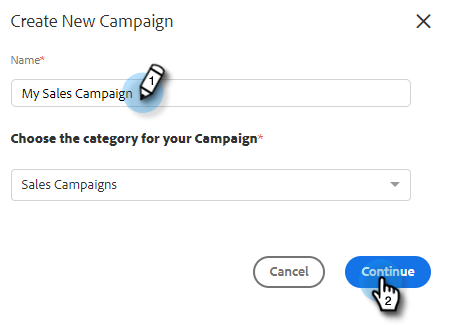

# Criar uma campanha de vendas {#create-a-sales-campaign}

Campanhas de vendas são uma série de etapas de vários canais, incluindo: emails, chamadas telefônicas, InMail e tarefas personalizadas. Eles permitem simplificar suas comunicações com seus clientes potenciais e existentes.

Com Campanhas de vendas, você pode:

* **Organizar**: Simplifique todas as atividades de alcance geral em um único local para uma execução eficiente.
* **Escala**: Programe todos os seus esforços de alcance para ampliar seus esforços, minimizar o trabalho manual e personalizar o quanto você precisar.
* **Medição**: Rastreie o sucesso de todos os seus emails e tarefas em um único local enquanto faz logon automático no Salesforce. Ao saber o que está causando ressonância e resultados, você pode testar e melhorar seus resultados de forma consistente.

Então, como configurar uma Campanha de Vendas?

1. Clique no botão **Campanhas** guia .

   

1. Selecione uma categoria e clique no botão **Criar Nova Campanha** botão.

   

   >[!NOTE]
   >
   >Crie uma nova categoria clicando no botão **+** ao lado de **Categorias**.

1. A categoria escolhida será selecionada. Se você mudar de ideia, clique no menu suspenso e selecione outro. Quando terminar, clique em **Continuar**.

   

1. Clique em **Adicionar uma etapa**.

   

1. Escolha entre: Email, Chamada, InMail ou Tarefa personalizada. Neste exemplo, estamos escolhendo Email.

   

1. Quando você estiver [concluído com seu email](/help/marketo/product-docs/marketo-sales-insight/actions/campaigns/sales-campaign-step-types-and-reminder-tasks.md#email){target=&quot;_blank&quot;}, clique em **Adicionar**.

   

1. Depois de criar o primeiro dia e a etapa , o botão &quot;Adicionar um dia&quot; é ativado e você pode adicionar quantos dias e etapas o processo de vendas exigir.

   

   >[!NOTE]
   >
   >&quot;Dias&quot; não é o número de dias entre ações, mas o dia na sequência. Por exemplo, se sua campanha de vendas durar 7 dias, inserir &#39;3&#39; significa que a ação será lançada no dia 3 de 7, **not** 3 dias depois.

1. Certifique-se de personalizar as opções de agendamento e resposta, como ignorar os finais de semana (o que é incrível) ao visitar o **Guia Configurações** para sua campanha de vendas.

   

Agora é hora de começar a adicionar pessoas!

>[!MORELIKETHIS]
>
>* [Opções de envio de campanha de vendas para etapas de email](/help/marketo/product-docs/marketo-sales-insight/actions/campaigns/sales-campaign-send-options-for-email-steps.md){target=&quot;_blank&quot;}
>* [Tipos de etapas da campanha de vendas e tarefas de lembrete](/help/marketo/product-docs/marketo-sales-insight/actions/campaigns/sales-campaign-step-types-and-reminder-tasks.md){target=&quot;_blank&quot;}
>* [Configurações da campanha de vendas](/help/marketo/product-docs/marketo-sales-insight/actions/campaigns/sales-campaign-settings.md){target=&quot;_blank&quot;}

