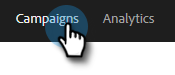
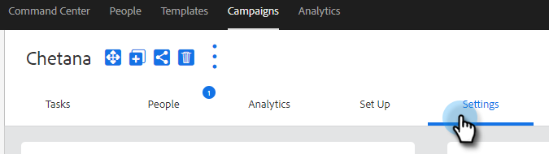

# Configurações da campanha de vendas {#sales-campaign-settings}

A seção de configurações Campanha de vendas permite configurar uma Campanha de vendas específica para que ela possa trabalhar para se adequar melhor aos casos de uso de sua equipe para essa Campanha de vendas.

## Ignorar fins de semana {#skip-weekends}

Ative a opção Ignorar fins de semana para que todas as etapas que teriam sido realizadas em um dia da semana (sábado ou domingo) sejam movidas para segunda-feira.

>[!NOTE]
>
>Com a opção [!UICONTROL Ignorar fins de semana] habilitada, os emails serão agendados com base em uma semana de 5 dias. Ou seja, quando uma etapa é agendada, os fins de semana serão ignorados como dias.

1. Clique em **[!UICONTROL Campanhas]**.

   

1. Escolha a Campanha de vendas desejada.

   

1. Clique na guia **[!UICONTROL Configurações]**.

   

1. Marque a caixa de seleção **[!UICONTROL Ignorar fins de semana]**.

   

## Remover na rejeição {#remove-on-bounce}

Se você estiver usando conexão de email, detectaremos rejeições com base na mensagem de rejeição enviada para a caixa de entrada dos usuários. Além disso, podemos remover pessoas de Campanhas de vendas quando uma rejeição for detectada.

1. Clique em **[!UICONTROL Campanhas]**.

   

1. Escolha a Campanha de vendas desejada.

   

1. Clique na guia **[!UICONTROL Configurações]**.

   

1. Marque a caixa de seleção **[!UICONTROL Remover na rejeição]**.

   

## Se ocorrer uma resposta {#if-a-reply-occurs}

Se o rastreamento de respostas estiver habilitado para o Gmail ou [!DNL Exchange], podemos encerrar automaticamente sua Campanha de Vendas se um destinatário responder ao seu email.

1. Clique em **[!UICONTROL Campanhas]**.

   

1. Escolha a Campanha de vendas desejada.

   

1. Clique na guia **[!UICONTROL Configurações]**.

   

1. Em **[!UICONTROL Se Ocorrer uma Resposta]**, faça a(s) seleção(ões) desejada(s).

   

>[!MORELIKETHIS]
>
>* [Criar uma campanha de vendas](/help/marketo/product-docs/marketo-sales-insight/actions/campaigns/create-a-sales-campaign.md){target="_blank"}
>* [Noções básicas sobre as opções de envio do Sales Campaign para etapas de email](/help/marketo/product-docs/marketo-sales-insight/actions/campaigns/understanding-sales-campaign-send-options-for-email-steps.md){target="_blank"}
>* [Tipos de Etapa da Campanha de Vendas e Tarefas de Lembrete](/help/marketo/product-docs/marketo-sales-insight/actions/campaigns/sales-campaign-step-types-and-reminder-tasks.md){target="_blank"}
