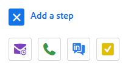

# Tipos de Etapa de Campanha de Vendas e Tarefas de Lembrete {#sales-campaign-step-types-and-reminder-tasks}

## Tipos de etapa da campanha de vendas {#sales-campaign-step-types}

Ao adicionar uma etapa à Campanha de vendas, você tem quatro opções.

### Email {#email}

Redija um novo email ou use um modelo preexistente.

| **[!UICONTROL Usar um Modelo]** | Selecione um dos modelos pré-existentes |
|---|---|
| **[!UICONTROL Salvar como Modelo]** | Salve o email que acabou de compor como um novo modelo |
| **Adicionar conteúdo** | Faça upload de um arquivo no nosso servidor e receba um URL (apontando para o conteúdo) que possa ser rastreado no seu email |
| **Anexar Arquivos** | Anexar um arquivo do seu computador ao email (limite de tamanho de 23 MB) |

>[!TIP]
>
>Saiba mais sobre as [opções de envio](/help/marketo/product-docs/marketo-sales-insight/actions/campaigns/understanding-sales-campaign-send-options-for-email-steps.md){target="_blank"}.

### Chamada {#call}

Defina um lembrete para acompanhar um contato por telefone. Você também pode salvar anotações para serem usadas como um talk track durante a chamada.

### InMail {#inmail}

Acompanhar em vários canais é uma ótima maneira de se conectar com clientes potenciais. Com tarefas do InMail, você pode configurar um lembrete para acessar por meio do LinkedIn.

### Tarefa personalizada {#custom-task}

Utilize tarefas personalizadas quando as opções acima não forem aplicáveis. Por exemplo, você pode convidar um colega para acompanhar um cliente potencial por email.

## Uso de tarefas de lembrete em campanhas de vendas {#using-reminder-tasks-in-sales-campaigns}

As tarefas são uma ferramenta eficiente ao enviar uma Campanha de vendas para um contato, especialmente se o processo de vendas for multicanal/toque.

Tarefa para enviar um email e Tarefa para chamar um contato são os usos mais comuns para Tarefas em Campanhas de vendas.

Você também pode transformar uma &quot;Tarefa para enviar email&quot; em um contato no LinkedIn se isso fizer parte do seu fluxo de trabalho. Você também pode fazer uma tarefa personalizada para lembrá-lo de convidá-los para um happy hour, perguntar sobre o evento de caridade ou check-in após o jogo 5, etc.

>[!NOTE]
>
>O mais importante sobre Tarefas em Campanhas de vendas é que você precisa concluir a tarefa para acionar a próxima etapa.

>[!MORELIKETHIS]
>
>[Criar uma campanha de vendas](/help/marketo/product-docs/marketo-sales-insight/actions/campaigns/create-a-sales-campaign.md){target="_blank"}
