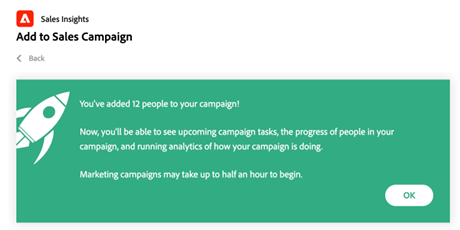

# Utilização de inclusão em massa para a campanha de vendas no Salesforce {#using-bulk-add-to-sales-campaign-in-salesforce}

Saiba como adicionar itens em massa ao Sales Campaign no Salesforce para ajudar a dimensionar a comunicação de saída usando as Ações de vendas.

>[!NOTE]
>
>O Salesforce impõe um limite de 200 registros que podem ser selecionados de uma só vez.

>[!PREREQUISITES]
>
>Certifique-se de ter instalado o [pacote mais recente do Sales Insight](/help/marketo/product-docs/marketo-sales-insight/msi-for-salesforce/upgrading/upgrading-your-msi-package.md){target="_blank"} na sua instância do Salesforce e configurado os [botões de ação](/help/marketo/product-docs/marketo-sales-insight/actions/crm/salesforce-package-configuration/add-action-buttons-to-salesforce-list-view.md){target="_blank"} nas suas exibições de contatos e listas de clientes potenciais no Salesforce.

## Adicionar em massa à campanha de vendas no Salesforce Lightning {#bulk-add-to-sales-campaign-in-salesforce-lightning}

1. No Salesforce, navegue até a página inicial de Clientes potenciais/Contatos clicando na guia **Clientes potenciais/Contatos**.

   

1. No menu suspenso **Exibir**, selecione a exibição desejada de Clientes Potenciais/Contatos que deseja enviar por email.

   >[!TIP]
   >
   >Você pode criar uma nova exibição clicando no ícone de engrenagem à direita e selecionando **Novo**. Depois de dar um novo nome à visualização e salvá-la, você pode clicar no ícone de filtro à direita para ajudar a filtrar para o conjunto desejado de Clientes potenciais/Contatos que deseja enviar por email.

1. Escolha a lista de clientes potenciais ou contatos desejada e clique no botão **Adicionar à Campanha de Vendas**.

   

1. Você será direcionado para o modal Ações Campanha de vendas, com os destinatários selecionados adicionados.

1. Faça as edições necessárias para remover pessoas ou grupos, depois clique em **Avançar**.

   

1. Selecione a Categoria da Campanha de Vendas que deseja usar no menu suspenso Categorias.

1. Selecione a Campanha de Vendas à qual você deseja adicionar as pessoas selecionadas e clique em **Avançar**.

   

1. Você pode ver opções diferentes dependendo da primeira etapa da campanha. Se o primeiro passo for um email, você terá a opção de editar o email para cada recipient, como visto abaixo. Quando terminar, clique em **Avançar**.

   

1. Novamente, se a primeira etapa for um email e você o tiver configurado para permitir selecionar quando a campanha será iniciada, você terá a opção de **Iniciar Agora** ou **Agendar uma Nova Hora de Início**. Depois de concluído, clique em **Iniciar**.

   

Depois de clicar em Iniciar, você verá uma tela de confirmação informando quantas pessoas foram adicionadas.

## Adicionar em massa à Campanha de vendas no Salesforce Classic {#bulk-add-to-sales-campaign-in-salesforce-classic}

1. No Salesforce, clique na guia **Clientes potenciais/Contatos**.

1. Na lista suspensa Exibir, selecione a exibição desejada de Clientes Potenciais/Contatos que deseja enviar por email e clique em **Ir**.

   

   >[!TIP]
   >
   >Você pode criar uma nova visualização clicando em Criar nova visualização e configurando os filtros disponíveis para restringir a lista de destinatários que você enviará por email.

1. Escolha o cliente potencial ou a lista de contatos desejada e clique no botão **Adicionar à Campanha de Vendas**.

   

1. Você será direcionado para o modal Ações Campanha de vendas com as pessoas selecionadas adicionadas.

1. Faça as edições necessárias para remover pessoas ou grupos, depois clique em **Avançar**.

   

1. Selecione a Categoria da campanha de vendas que deseja usar no menu suspenso **Categorias**.

1. Selecione a Campanha de Vendas à qual você deseja adicionar as pessoas selecionadas e clique em **Avançar**.

   

1. Você pode ver opções diferentes dependendo da primeira etapa da campanha. Se o primeiro passo for um email, você terá a opção de editar o email para cada recipient, como visto abaixo. Quando terminar, clique em **Avançar**.

   

1. Novamente, se a primeira etapa for um email e você o tiver configurado para permitir selecionar quando a campanha será iniciada, você terá a opção de **Iniciar Agora** ou **Agendar uma Nova Hora de Início**. Depois de concluído, clique em **Iniciar**.

   

Depois de clicar em Iniciar, você verá uma tela de confirmação informando quantas pessoas foram adicionadas.

