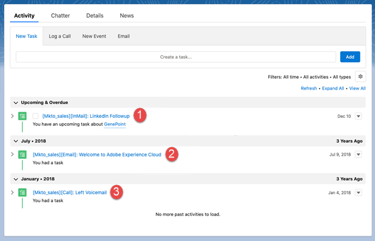
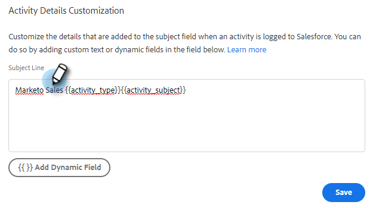

# Configurar a personalização dos detalhes de atividade do Salesforce {#configure-salesforce-activity-detail-customization}

>[!PREREQUISITES]
>
>* As ações do Salesforce e do Sales Insight [devem estar conectadas](/help/marketo/product-docs/marketo-sales-insight/actions/crm/salesforce-integration/connect-your-sales-insight-actions-account-to-salesforce.md)
>* A atividade de email de log via API [deve ser habilitada](/help/marketo/product-docs/marketo-sales-insight/actions/crm/salesforce-integration/sync-sales-activities-to-salesforce.md)

A Personalização dos detalhes da atividade permite que os administradores configurem as informações que farão logon na Tarefa do Salesforce - Campo de assunto, quando uma atividade de ações de insight de vendas/tarefa de lembrete for sincronizada com o Salesforce.

>[!NOTE]
>
>* As atualizações feitas no campo de assunto em Ações de insight de vendas de uma tarefa de lembrete serão refletidas no campo de assunto da tarefa do Salesforce correspondente, se você estiver usando o campo dinâmico `{{activity_subject}}` na Personalização dos detalhes da atividade.
>* Quebras de linha não são suportadas ao registrar informações no campo de assunto do Salesforce. Quaisquer quebras de linha no editor de Personalização de Detalhes da Atividade serão removidas quando um assunto da tarefa de vendas for atualizado.

<table>
 <tr>
  <td><strong>1</td>
  <td>Tarefa de lembrete do InMail</td>
 </tr>
 <tr>
  <td><strong>2</td>
  <td>Atividade de e-mail</td>
 </tr>
 <tr>
  <td><strong>3</td>
  <td>Atividade de chamada</td>
 </tr>
</table>

O recurso pode ser usado para desbloquear os seguintes benefícios:

* Personalizando quais informações estão visíveis no campo de assunto, os detalhes da atividade são facilmente verificáveis para vendas no Salesforce.
* Os administradores podem marcar o campo de assunto com um identificador exclusivo, como &quot;Mkto_sales&quot;, para que as atividades de Ações de Insight de vendas possam ser facilmente identificadas e diferenciadas de outras atividades de email, atividades de chamada e tarefas.
* Reduza a necessidade de campos de atividade personalizados. O Salesforce impõe limites ao número de campos de atividade personalizados, que podem restringir quais dados estão disponíveis para serem usados em relatórios. Ao usar campos dinâmicos de atividade para adicionar dados principais à linha de assunto, você pode reduzir o número de campos de atividade personalizados que precisam ser criados em sua instância do Salesforce.
* O campo de assunto das atividades e tarefas seguirá um padrão consistente definido pelo Administrador de ações do Sales Insight.

>[!NOTE]
>
>Se você estiver registrando respostas de email como atividades no Salesforce, eles não usarão as configurações de Personalização de detalhes de atividades do Salesforce. Em vez disso, eles serão registrados como &quot;Responder: Assunto do email&quot;.

## Campos Dinâmicos De Atividade Compatíveis {#activity-dynamic-fields-supported}

Campos Dinâmicos da Atividade fazem referência a informações sobre suas atividades de vendas para preencher dados. Hoje, elas podem ser usadas com a Personalização de detalhes de atividades do Salesforce.

>[!NOTE]
>
>Se não houver um valor para preencher o campo dinâmico de uma atividade/tarefa específica, ele não preencherá nenhum dado desse campo dinâmico quando a Tarefa do Salesforce - Campo Assunto for atualizada.

<table>
 <tr>
  <th>Campo</th>
  <th>Descrição</th>
 </tr>
 <tr>
  <td>{{activity_type}}</td>
  <td>Preencherá o tipo de tarefa como Email, Chamada, InMail ou Personalizado.</td>
 </tr>
 <tr>
  <td>{{activity_subject}}</td>
  <td>
Preencherá o assunto da tarefa.

      
No caso de um email, ele preencherá a linha de assunto do email.

      
No caso de chamada, inMail ou personalizado, ele preencherá um valor se houver uma tarefa de lembrete criada com um valor no campo de nome/assunto da tarefa.
</td>
 </tr>
 <tr>
  <td>{{sales_campaign_name}}</td>
  <td>Se a atividade foi iniciada a partir de uma campanha de vendas, ela preencherá o nome da campanha de vendas.</td>
 </tr>
 <tr>
  <td>{{sales_campaign_day}}</td>
  <td>Se a atividade foi iniciada a partir de uma campanha de vendas, ela preencherá o número do dia da campanha de vendas em que essa atividade ocorreu.</td>
 </tr>
 <tr>
  <td>{{sales_campaign_step}}</td>
  <td>Se a atividade foi iniciada a partir de uma campanha de vendas, ela preencherá o número da etapa no dia da campanha de vendas em que essa atividade ocorreu.</td>
 </tr>
 <tr>
  <td>{{call_outcome}}</td>
  <td>Se a atividade for uma chamada e um resultado da chamada for selecionado, o valor do resultado da chamada será preenchido.</td>
 </tr>
 <tr>
  <td>{{call_reason}}</td>
  <td>Se a atividade for uma chamada e um motivo de chamada for selecionado, isso preencherá o valor do motivo da chamada.</td>
 </tr>
</table>

## Configuração da personalização dos detalhes de atividade do Salesforce {#configuring-salesforce-activity-detail-customization}

>[!NOTE]
>
>**Permissões de administrador necessárias.**

Ao configurar os detalhes da atividade, considere quais dados seriam mais relevantes para as vendas ao revisar o histórico de tarefas no Salesforce.

1. Clique no ícone de engrenagem e selecione **Configurações**.

   

1. Clique em **Salesforce**.

   

1. Clique em **Configurações de sincronização**.

   

1. No editor de Personalização de detalhes da atividade, adicione o texto livre desejado. O texto adicionado é não dinâmico e permanecerá inalterado para o campo de assunto de todas as tarefas sincronizadas com o Salesforce.

   

   >[!TIP]
   >
   >Embora não seja obrigatório, quebrar o texto adicionado em colchetes pode facilitar para algumas pessoas discernir entre os dados quando eles são preenchidos em um campo de assunto no Salesforce. Exemplo: `[Sales Insight Actions] - {{Activity_type}}`

1. Adicione outros campos dinâmicos desejados clicando no botão **Adicionar Campo Dinâmico**.

   

1. Selecione os campos dinâmicos desejados.

   

1. Clique em **Salvar**.

   

>[!NOTE]
>
>O Salesforce impõe um limite de 255 caracteres. Se os detalhes da atividade excederem esse limite, eles serão truncados para garantir que as informações sejam armazenadas no campo de assunto do Salesforce.

>[!MORELIKETHIS]
>
>* [Sincronizar atividades de vendas com o Salesforce](/help/marketo/product-docs/marketo-sales-insight/actions/crm/salesforce-integration/sync-sales-activities-to-salesforce.md)
>* [Sincronização de tarefas de lembrete com o Salesforce](/help/marketo/product-docs/marketo-sales-insight/actions/tasks/reminder-task-sync-with-salesforce.md)
