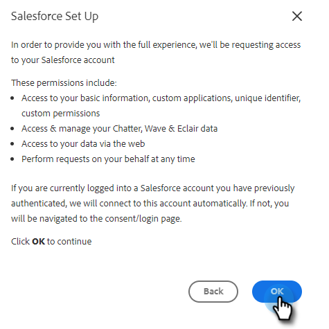

# Conectar sua Conta do [!DNL Sales Insight Actions] ao [!DNL Salesforce] {#connect-your-sales-insight-actions-account-to-salesforce}

Siga estas etapas simples para conectar a conta do [!DNL Sales Insight Actions] ao [!DNL Salesforce].

## Como se conectar como administrador {#how-to-connect-as-an-admin}

1. Clique no ícone de engrenagem e selecione **[!UICONTROL Configurações]**.

   

1. Em [!UICONTROL Configurações de Administração], clique em **[!UICONTROL Salesforce]**.

   

1. Na guia [!UICONTROL Conexões e Personalizações], clique em **[!UICONTROL Salesforce]** e em **[!UICONTROL Conectar]**.

   

1. Clique em **[!UICONTROL OK]**.

   

1. Se você já estiver conectado ao Salesforce, estará conectado. Caso não esteja, você será solicitado a fazer logon.

## Como se conectar como um não administrador {#how-to-connect-as-a-non-admin}

1. Clique no ícone de engrenagem e selecione **[!UICONTROL Configurações]**.

   

1. Em [!UICONTROL Minha conta], selecione **[!UICONTROL Salesforce]**.

1. Na [!UICONTROL guia Conexões e Personalizações], clique em **[!UICONTROL Salesforce]** e em **[!UICONTROL Conectar]**.

   

1. Clique em **[!UICONTROL OK]**.

   

1. Se você já estiver conectado ao Salesforce, estará conectado. Caso não esteja, você será solicitado a fazer logon.
